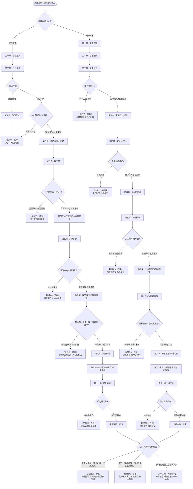

# 《重开三国》全剧情宏观大纲与设定详案
### —— 双线史诗：从双击 Bug 穿越到双龙归一的大一统总纲

> **【设计定位与阅读指引】**
> 本案为《重开三国》（Godot 4 战棋卡牌 RPG）全 12 章主线剧情、宿命轮回分支与角色设定的**唯一总指导详案（Story Bible）**。
> 1. **实现原则**：游戏采取敏捷迭代（当前已实装至第六章）。真正的游戏以 `godot/data/story.json` 实装内容为准，未做章节按本案方向设计，并在实装后同步回填。
> 2. **叙事基调**：兰斯10式大地图探索 + 三国群侠传式逗趣冒险。主角为 30 岁现代采购社畜灵魂，深谙保命与管理学，不熟三国演义细节，逗比吐槽不断，但骨子里重情重义。
> 3. **双线机制**：南北双线在世界中平行演进，不同周目选择不同出生点体验平行推进，直到第十一章于洛阳交汇，最终导向单线悲剧（赤壁/官渡）或真结局（天命归一）。

---

## 目录（Table of Contents）
- [一、 核心世界观与底层设定（Meta-Premise）](#一-核心世界观与底层设定meta-premise)
  - [1. 穿越契机：天道代码的「双击 Bug」](#1-穿越契机天道代码的双击-bug)
  - [2. 双身主角：形象、性格与代入设定](#2-双身主角形象性格与代入设定)
  - [3. 核心叙事法则与文风规范](#3-核心叙事法则与文风规范)
- [二、 全局编年史与双线路线总览](#二-全局编年史与双线路线总览)
  - [1. 全局编年史对照表（190年～207年）](#1-全局编年史对照表190年207年)
  - [2. 宿命轮回与全结局拓扑结构图](#2-宿命轮回与全结局拓扑结构图)
- [三、 第一卷：潜龙在渊（第一章至第五章 · 南北分立）](#三-第一卷潜龙在渊第一章至第五章--南北分立)
  - [第一章：风云初动（190年 春）](#第一章风云初动190年-春)
    - [【南线：富春江畔 · 孙氏结义】](#南线富春江畔--孙氏结义)
    - [【北线：中山雪夜 · 甄府结缘】](#北线中山雪夜--甄府结缘)
    - [【双线呼应与彩蛋】](#双线呼应与彩蛋-1)
  - [第二章：洛阳烟云（190年 二月 至 初夏）](#第二章洛阳烟云190年-二月-至-初夏)
    - [【南线：汜水虎牢 · 义释董白】](#南线汜水虎牢--义释董白)
    - [【北线：逐鹿中原 · 虎牢逃婚】](#北线逐鹿中原--虎牢逃婚)
    - [【双线呼应与罗生门彩蛋】](#双线呼应与罗生门彩蛋-2)
  - [第三章：乱世微光（190年 夏 至 192年）](#第三章乱世微光190年-夏-至-192年)
    - [【南线：长安惊变 · 文姬与连环计】](#南线长安惊变--文姬与连环计)
    - [【北线：黑山风云 · 斑马义旗（界桥之战）】](#北线黑山风云--斑马义旗界桥之战)
    - [【双线呼应与反派脉络】](#双线呼应与反派脉络-3)
  - [第四章：天子之争（191年 至 193年）](#第四章天子之争191年-至-193年)
    - [【南线：奉迎天子 · 经略南阳】](#南线奉迎天子--经略南阳)
    - [【北线：双凤乱太行 · 仁义定北海】](#北线双凤乱太行--仁义定北海)
    - [【双线呼应与名将认脸】](#双线呼应与名将认脸-4)
  - [第五章：基业初奠（193年 至 195年）](#第五章基业初奠193年-至-195年)
    - [【南线：荆襄明月 · 智破蔡氏】](#南线荆襄明月--智破蔡氏)
    - [【北线：铁纪徐州 · 陶府风云】](#北线铁纪徐州--陶府风云)
    - [【双线呼应与士族暗流】](#双线呼应与士族暗流-5)
- [四、 第二卷：中原劫火（第六章至第八章 · 交汇与背刺）](#四-第二卷中原劫火第六章至第八章--交汇与背刺)
  - [第六章：淮南折帝旗（196年 至 197年）](#第六章淮南折帝旗196年-至-197年)
    - [【南北同场背景与讨袁诏书】](#南北同场背景与讨袁诏书)
    - [【南线：淮南折帝旗 · 庐江与寿春（双婚）】](#南线淮南折帝旗--庐江与寿春双婚)
    - [【北线：淮南折帝旗 · 寿春煮酒（断桥）】](#北线淮南折帝旗--寿春煮酒断桥)
    - [【双线同场会师：淮水浮桥一瞥】](#双线同场会师淮水浮桥一瞥)
  - [第七章：邺城惊雷 · 江东小霸王（197年 至 199年）](#第七章邺城惊雷--江东小霸王197年-至-199年)
    - [【南线：江东小霸王（平定江东）】](#南线江东小霸王平定江东)
    - [【北线：邺城惊雷（奇袭邺城）】](#北线邺城惊雷奇袭邺城)
  - [第八章：北海龙虎 · 猛虎之陨（199年 至 200年）](#第八章北海龙虎--猛虎之陨199年-至-200年)
    - [【南线：猛虎之陨（孙坚战死、易帜为吴）】](#南线猛虎之陨孙坚战死易帜为吴)
    - [【北线：北海龙虎（守卫北海、郭嘉不死）】](#北线北海龙虎守卫北海郭嘉不死)
    - [【第八章终局态势：天下双雄并峙】](#第八章终局态势天下双雄并峙)
- [五、 第三卷：终极对决（第九章至第十二章 · 决战与真结局）](#五-第三卷终极对决第九章至第十二章--决战与真结局)
  - [第九章：西凉喋血 · 天府之国（201年）](#第九章西凉喋血--天府之国201年)
    - [【南线：天府之国（平定益州、七擒孟获）】](#南线天府之国平定益州七擒孟获)
    - [【北线：西凉喋血（延津救马超、平定塞外）】](#北线西凉喋血延津救马超平定塞外)
  - [第十章：三道防线 · 奇袭关中（202年）](#第十章三道防线--奇袭关中202年)
    - [【南线：奇袭关中（出秦岭下长安、洛水破八阵）】](#南线奇袭关中出秦岭下长安洛水破八阵)
    - [【北线：三道防线（官渡陈留虎牢连破三防）】](#北线三道防线官渡陈留虎牢连破三防)
    - [【南北重战虎牢 · 洛阳孤岛大合围】](#南北重战虎牢--洛阳孤岛大合围)
  - [第十一章：洛阳天倾（202年）](#第十一章洛阳天倾202年)
    - [【南线：洛水诛神（辕门决断、洛水斩吕布）】](#南线洛水诛神辕门决断洛水斩吕布)
    - [【北线：出师表（白衣出降、识破诸葛亮）】](#北线出师表白衣出降识破诸葛亮)
    - [【结局分流判决表】](#结局分流判决表)
    - [【响箭相约：通往最终章】](#响箭相约通往最终章)
  - [终局单线悲剧结局（独夫系列）](#终局单线悲剧结局独夫系列)
    - [【南线结局 · 赤壁（独夫）】](#南线结局--赤壁独夫)
    - [【北线结局 · 官渡（独夫）】](#北线结局--官渡独夫)
  - [第十二章：天命归一（真结局 · 202年冬 至 207年）](#第十二章天命归一真结局--202年冬-至-207年)
    - [一、 地宫里的老乡（对暗号与双体归一）](#一-地宫里的老乡对暗号与双体归一)
    - [二、 天下英雄归宿（各人结局与追封）](#二-天下英雄归宿各人结局与追封)
    - [三、 家里人与修罗场（后宫与团圆）](#三-家里人与修罗场后宫与团圆)
    - [四、 尾声：退休（屋顶撸串、卸载系统）](#四-尾声退休屋顶撸串卸载系统)
- [六、 宿命轮回系统与全 Bad End 档案库](#六-宿命轮回系统与全-bad-end-档案库)
  - [1. 轮回破局机制与收人门槛对照表](#1-轮回破局机制与收人门槛对照表)
  - [2. 全 Bad End 详案归档（结局一 ～ 结局九）](#2-全-bad-end-详案归档结局一--结局九)
    - [【结局一 · 玉碎】（南线第三章）](#结局一--玉碎南线第三章)
    - [【结局二 · 同归】（南线第四章）](#结局二--同归南线第四章)
    - [【结局三 · 恨海】（南线第五章）](#结局三--恨海南线第五章)
    - [【结局四 · 虎噬】（南线第十一章陷阱）](#结局四--虎噬南线第十一章陷阱)
    - [【结局五 · 烛灭】（北线第十一章陷阱）](#结局五--烛灭北线第十一章陷阱)
    - [【结局六 · 覆巢】（北线第三章分支）](#结局六--覆巢北线第三章分支)
    - [【结局七 · 绝罚】（北线第四章分支）](#结局七--绝罚北线第四章分支)
    - [【结局八 · 失律】（北线第五章分支）](#结局八--失律北线第五章分支)
    - [【结局九 · 断桥】（北线第六章分支）](#结局九--断桥北线第六章分支)
  - [3. Bad End 脚本编写三原则（黄金法则）](#3-bad-end-脚本编写三原则黄金法则)
- [七、 人物谱系与红颜图鉴](#七-人物谱系与红颜图鉴)
  - [1. 已实装核心红颜与专属结局映射表](#1-已实装核心红颜与专属结局映射表)
  - [2. 关键人物核心动机与跨线设定](#2-关键人物核心动机与跨线设定)
    - [【左慈：唯一洞悉真相的观察者】](#左慈唯一洞悉真相的观察者)
    - [【吕布：跨线认脸与心魔崩解】](#吕布跨线认脸与心魔崩解)
    - [【郭图：横贯北线前期的贪婪与宿怨】](#郭图横贯北线前期的贪婪与宿怨)
    - [【诸葛亮：少年神机与黑化悲剧】](#诸葛亮少年神机与黑化悲剧)
  - [3. 后续扩展红颜席位与预留专属 Bad End 规划](#3-后续扩展红颜席位与预留专属-bad-end-规划)

---

## 一、 核心世界观与底层设定（Meta-Premise）

### 1. 穿越契机：天道代码的「双击 Bug」
* **主角原型**：现代 30 岁资深采购打工人（社畜）。前世精通企业财务核算、组织架构、物料供应链与职场保命之道；嘴碎幽默，是个逗比，深谙底层生存智慧，但骨子里极重情义。
* **三国知识储备薄弱**：当年《三国演义》原著根本没读完，读过的细节也早已模糊（「三国演义我不熟啊」「早知道会穿越，当年就该把那本书读完」）。只认识教科书、影视剧和游戏里的大梗与顶流名人（三让徐州、三英战吕布、关羽、刘备、曹操、孙策、周瑜、诸葛亮、吕布、蔡文姬、二乔、左慈等）；对绝大多数二线历史人物一概「没听过」；预知能力极薄，仅知「见到吕布赶紧跑」。
* **时空分裂契机**：加班至凌晨三点，主角点开《重开三国》。在出生点选择界面，因鼠标按键微动故障，意外**连续双击**了两个互斥选项——
  * **【南方 · 江东富春（吴夫人）】**
  * **【北方 · 冀州无极（甄家 · 张夫人）】**
* **数据冗余与实体分裂**：
  * 天道底层判定发生严重竞态条件（Race Condition）。为防系统崩溃，天道将同一个灵魂（完全相同的 UID、记忆、现代思维习惯与口癖）克隆并投射至两具不同容器中，于公元 190 年（初平元年正月）同时投放在江南富春江畔与北方太行雪地。
  * **两具身体的异同**：
    * **南线肉身**：初平元年为 18 岁少年身躯，顶着前世扎手的**现代寸头**（汉代视短发为受过髡刑，吴夫人爱摸、孙策孙坚爱笑）。后着孙坚早年旧银甲（虎纹护肩、白毛滚边黑披风，内衬虎皮裙），持孙坚年轻时的重型大刀（祠堂供奉的旧刀，扔刀技能来源）。
    * **北线肉身**：初平元年约 20 岁身躯。作为现代人本不留长发，但北方严寒刺骨，为防冻御寒遂**束起长发戴盔**。身披甄宓亡父留下的旧鱼鳞甲、外罩雪白貂皮披风，手持白蜡杆长枪（师从赵云，枪杆系着甄宓编织的红色平安结）。
    * **岁月流逝**：两具身体随章节真实年龄增长（南线第一章 18 岁，至第五章 21 岁，终章近 30 岁；北线亦随之步入青年至壮年）。
  * **隐性伏笔与跨线暗涌**：两线主角初期互不知晓对方存在。然而随着天下兼并、政令互通，现代管理黑话（「降维打击」、「闭环」、「赋能」、「复式记账法」、「地推」）在南北两端同时涌现；两线主角在战场上揉太阳穴、下意识摸兜的社畜本能动作完全一致。

### 2. 双身主角：形象、性格与代入设定
* **南线（孙氏 / 荆襄 / 江东 / 西南）**：
  * **风格特色**：江东风流、波澜壮阔的水上史诗、多女主柔情、铁血托孤与水战连环。
  * **核心阵营**：孙策、周瑜、黄忠、甘宁、贾诩、荀攸、蒯越、鲁肃、陆逊。
  * **核心红颜与长辈**：吴夫人（慈母长辈）、董白、蔡文姬、貂蝉、孙尚香。大乔归孙策，小乔归周瑜（兄弟之妻，绝不逾矩）。
* **北线（甄府 / 常山 / 徐州 / 河北 / 塞外）**：
  * **风格特色**：中原逐鹿、重装铁骑突阵、商道治国、名士博弈与边塞风云。
  * **核心阵营**：赵云、太史慈、马腾、马超、郭嘉、张辽、高顺、夏侯兰。
  * **核心红颜与长辈**：张夫人（主母长辈，待主角如亲生子）、张宁（医仙圣女）、吕玲绮（将门孤女）、甄宓（初为兄妹，终章成年结缡）、郑好与姜巧、郭女王、杜夫人、马云騄。糜贞归赵云（名将良缘）。

### 3. 核心叙事法则与文风规范
1. **主角人设永葆逗比（幽默克制）**：主角是现代社畜，无论置身绝境或凄美时刻，均以冷幽默、现代吐槽化解沉重；但他绝非冷血之徒，面对百姓疾苦与将士牺牲，总有沉重的悲悯与担当。
2. **绝对禁止后宫幼态与失德**：所有恋爱线女主角登场时必须为成年女子（18 岁以上）。甄宓在第一章为十三四岁小姑娘，必须是纯净干净的兄妹情，严禁任何暧昧，直至终章成年方成大礼；孙尚香第一章为八九岁幼童，第七章十八九岁方入队。长辈（吴夫人、张夫人）纯粹展现母爱，绝不涉男女私情。
3. **名将登场前置原则**：所有有名有姓的敌方将领、精英或首领，必须在战斗格之前的剧情格完成正式亮相与动机铺垫（为何而战、性格特质），严禁战胜后再补介绍。
4. **标点与对白规范**：对白严格使用中文引号「」与内层『』；严禁使用英文 ASCII 引号或弯引号；行文简洁短促，适配视觉小说单行字幕节奏。
5. **结局门槛严守数据标记**：剧情解锁与收人门槛严格依赖存档中的 `flags` / `record`，严禁在文档或代码中书写「第 N 周目解锁」，一律使用如「需先触发『结局一 · 玉碎』」的标记法则。

---

## 二、 全局编年史与双线路线总览

### 1. 全局编年史对照表（190年～207年）

| 章节 | 时间节点 | 南线剧目与主要舞台 | 北线剧目与主要舞台 | 双线交汇与重大历史事件 | 实装状态 |
| :--- | :--- | :--- | :--- | :--- | :--- |
| **第一章** | 190年 初平元年春 | **富春江畔 · 孙氏结义** （富春江、水寨、大寨） | **中山雪夜 · 甄府结缘** （中山无极、真定、太行） | 双体苏醒，救母/拜母，招募首批兄弟将领 | ✅ 已实装 （`prologue` 南北分支） |
| **第二章** | 190年 二月～初夏 | **汜水虎牢 · 义释董白** （汜水关、虎牢关前、洛阳） | **逐鹿中原 · 虎牢逃婚** （黄河古道、酸枣、汴水、虎牢） | 诸侯讨董，救董白/救吕玲绮，吕布夜袭罗生门，洛阳大火 | ✅ 已实装 （`taodong` / `luoyang_n`） |
| **第三章** | 190年 夏～192年 | **长安惊变 · 文姬与连环计** （洛阳郊外、鲁阳、长安） | **黑山风云 · 斑马义旗** （常山真定、太行黑山、界桥） | 救蔡文姬/救张宁；南线连环计杀董卓，北线界桥救公孙瓒 | ✅ 已实装 （`yuxi`,`shouluoyang`,`changan` / `heishan`） |
| **第四章** | 191年～193年 秋 | **奉迎天子 · 经略南阳** （长安宣平门、函谷关、南阳宛城） | **双凤乱太行 · 仁义定北海** （太行山口、北海城下、北海郡府） | 宣平门突围/太行山口阻吕布；南线迎天子进洛阳，北线受让北海相 | ✅ 已实装 （`dongui` / `beihai`） |
| **第五章** | 193年～195年 冬 | **荆襄明月 · 智破蔡氏** （宛城、淯水、襄阳万山水阁） | **铁纪徐州 · 陶府风云** （下邳城外、刺史府、小沛） | 南线督荆襄九郡大都督，北线接徐州牧；陈宫供养 | ✅ 已实装 （`jingxiang` / `xuzhou`） |
| **第六章** | 196年～197年 春 | **淮南折帝旗 · 庐江寿春** （襄阳、舒县、皖城、寿春南门） | **淮南折帝旗 · 寿春煮酒** （下邳、淮北、蕲阳、寿春东门） | **首次同场**：奉诏/家书讨袁术；寿春煮酒论英雄，淮水浮桥同源一瞥 | ✅ 已实装 （`huainan_s` / `huainan_n`） |
| **第七章** | 197年～199年 春 | **江东小霸王** （神亭岭、吴郡、会稽、富春还乡） | **邺城惊雷** （泰山、太行滏口陉、邺城、巨鹿原） | 南线孙策平定江东还乡；北线剿灭泰山后赵云大婚，北征时陈宫入队，奇袭邺城水淹颜良文丑 | 规划完备（待实装） |
| **第八章** | 199年 冬～200年 冬 | **猛虎之陨** （汉江渡口托孤、汉水对峙） | **北海龙虎** （北海城下、黄河巡线、幽州雪） | 曹操突袭洛阳夺玺；南线孙坚阵亡易帜为吴，北线郭嘉不死 | 规划完备（待实装） |
| **第九章** | 201年 春～冬 | **天府之国** （三峡夔门、江州、成都、泸水） | **西凉喋血** （延津抢滩、白狼山、辽东襄平） | 两线巩固大后方：南线平定益州七擒孟获，北线延津救马超平定塞外 | 规划完备（待实装） |
| **第十章** | 202年 春～夏 | **奇袭关中** （金牛道、秦岭、长安、洛水破八阵） | **三道防线** （官渡、陈留白马坡、虎牢关破防） | 南北大军东西合围中原；南线夺长安兵临洛阳，北线破三防克虎牢 | 规划完备（待实装） |
| **第十一章**| 202年 秋～冬 | **洛水诛神** （洛阳城南、辕门决断、洛水斩吕布） | **出师表** （洛阳城北、白衣出降、识破诸葛亮） | 洛阳孤岛大合围；南线诛杀吕布，北线识破诸葛；双周目判定分流 | 规划完备（待实装） |
| **终局分支**| 202年 冬～203年 春 | **南线结局 · 赤壁（独夫）** （北线遭鸩杀，北军南侵，赤壁决胜） | **北线结局 · 官渡（独夫）** （南线受吕布噬，吕布发狂，官渡决胜） | 单线缺失悲剧：一统天下却成孤家寡人，无人听懂现代梗 | 规划完备（单线悲剧） |
| **第十二章**| 202年 冬～207年 | **天命归一（真结局）** （太极殿地宫相会、双体融合归一） | **天命归一（真结局）** （平定天下、追封功臣、群英乐业、退休） | 宿命完结：地宫老乡对暗号，系统溢出收敛归一；五年后屋顶撸串大团圆 | 规划完备（终极真结局） |

---

### 2. 宿命轮回与全结局拓扑结构图

---

## 三、 第一卷：潜龙在渊（第一章至第五章 · 南北分立）

---

### 第一章：风云初动（190年 春）

#### 【章节概况】
* **年代**：初平元年（190年）正月 至 春
* **双线舞台**：南线【江东富春江畔】 vs 北线【冀州中山无极 · 甄府】
* **实装状态**：✅ 已实装（统一载体为 `prologue`，南线 x 0–22，北线 x 23–31+）。

---

#### 【南线：富春江畔 · 孙氏结义】
* **舞台**：富春江边 → 富春山庄 → 水寨 → 江心大寨（芦苇荡）
* **我方核心**：主角（18岁、现代寸头）、吴夫人（义母长辈）、孙策（17岁）、周瑜（16岁）；露脸幼童：孙权（10岁）、孙尚香（9岁）
* **敌对势力**：钱塘水寇「浪里蛟」胡玉、黄巾渠帅何仪、妖道唐周

**剧情脉络**：
1. **落水之厄**：初平元年正月，主角被孙坚正妻**吴夫人**从冰冷的富春江中捞起，醒来是一具十八岁寸头少年身躯。吴夫人母性泛滥，摸他的短发、吹换伤药，对主角满嘴现代油腔滑调不仅不怪罪，反而怜惜呵护。村中壮丁皆随孙坚北上讨董，只余老弱与少年。
2. **孙策与周瑜**：孙策性急莽撞、天生不会水、因留守后方而生闷气，拔枪便试探身手；周瑜聪敏深沉却极精打细算，随身携带一本**小账本**，分厘必争（主角饮下的米粥亦被记上一笔）。廊下十岁的孙权规矩作揖，目光如商人盘点市价；九岁的孙尚香手挥木刀直劈主角小腿（伏笔埋设）。
3. **富春山庄夜袭**：钱塘水寇胡玉趁虚夜袭火烧山庄，掳走吴夫人。柴房火起，主角舍命冲进烟火中将孙尚香夹在腋下救出，孙权一桶凉水当头浇下，孙尚香从此唤其「救命兄长」。面对敌寨，定计分叉：孙策主张正面强攻，周瑜主张调虎离山——玩家择谁计策，谁便率先入队。杀入敌寨救出吴夫人时，胡玉一眼认出主角肩抗的大刀：「这是当年孙坚在钱塘砍老子的那把刀！」压惊宴上，吴夫人连夹三块红烧肉犒赏。
4. **端掉何仪大寨**：胡玉退守江心大寨与何仪合流，妖道唐周设坛做法。主角自行募兵（丹阳兵、长沙刀兵），大破水寨。吴夫人自宝库中寻回首饰盒，并将孙坚早年所穿的精制银甲赠予主角（「后来他胖了，穿不下了」）。
5. **江边三结义**：依生辰长幼，主角为大哥（年长孙策一岁、周瑜两岁），孙策次之，周瑜为三弟——「桃园？咱们这是江边！」。孙策直呼「短毛大哥」，主角戏称孙策为「虎子」、周瑜为「三弟」（背地称「周扒皮」，被撞破罚一文钱）。
6. **送别与慈母针线**：吴夫人随军北上，将权、香托付曲阿。孙尚香扒着车窗喊道：「等我长大了，跟你比刀！」出发前夜，吴夫人在油灯下为主角细缝滚边冬衣（「北边冷」），孙策在窗外艳羡不已。

**关卡与机制（游戏内：`prologue` 南方分支）**：
* **分支与选择**：开局二选一（随周瑜寻私房钱 / 随孙策狩猎野猪林）；定计二选一（孙策强攻门 / 周瑜放火调虎）。
* **战斗配置**：普通战「水贼喽啰」→ 首领「水寨 · 浪里蛟胡玉」→ 征兵招募 → 精英「妖道唐周」→ 首领「何仪大寨 · 黄巾渠帅何仪」。
* **战后整备**：吴夫人、孙策、周瑜入队；丹阳兵、长沙刀兵入池；获得宝物「旧甲」。

---

#### 【北线：中山雪夜 · 甄府结缘】
* **舞台**：太行山口雪原 → 中山无极甄府 → 邺城州衙 → 太行山麓黑山寨
* **我方核心**：主角（约20岁、为防冻初束长发）、张夫人（甄府掌门主母）、甄宓（十三四岁幼女）、赵云（青年银甲）、郭嘉（街头落魄谋士）
* **敌对势力**：督粮官郭图、黑山贼魁李大目、黄巾渠帅张白骑、妖道玄机子

**剧情脉络**：
1. **雪地逢生**：初平元年正月，主角冻仆于太行雪原，为甄家商队所救，安置于中山无极甄府。北方朔风严寒，主角束起长发御寒。主母**张夫人**精明严厉却外冷内热，以账目相试。主角祭出复式记账法、平准仓与护卫重组方案，一月内扭亏为盈。幼年**甄宓**常扒门框甜唤「账房哥哥」，结下深厚纯净之兄妹羁绊。
2. **邺城州衙与街头郭嘉**：开春诸侯盟誓，韩馥下令竭全州之粮襄助联军。袁绍亲信督粮官**郭图**强行搜刮雪灾后的常山真定，青年义士**赵云**带乡民千里赶到邺城州衙请命求粮反遭笞杖凌辱，韩馥软弱旁观。酒旗下烂醉如泥的**郭嘉**冷笑点破乱世虚妄。主角挺身而出，以甄记商行名义无息借予三千石麦粮解民倒悬，郭图悻悻而去，由此与赵云、郭嘉初识结缘。
3. **黑山突袭与破寨救宓**：张夫人携甄宓押粮常山施粥，途经太行险隘遭李大目、张白骑伏击，妖道玄机子趁乱掳走甄宓欲行血祭。郭嘉雪地划策：主角上风口放火疑兵，赵云潜行水洞突袭，郭嘉正面鸣锣虚张声势。赵云枪挑玄机子救出甄宓；危急关头主角持长枪笨拙架住李大目斩骨巨斧，赵云回马枪一击贯穿敌喉，张白骑跳崖遁逃。
4. **开仓放粮与名师教枪**：战后黑山余粮尽散灾民，流民降卒感念恩义，编为主角首支嫡系劲旅——常山铁骑与太行义勇。赵云晨曦督促主角苦练枪术，由顶门横杠进阶至拦、拿、扎，练枪走火不慎扎穿张夫人悬晾院中的狐裘，欢笑满院。主角从此弃刀专修枪术，师承子龙。
5. **南下会盟**：围炉夜话间，郭嘉带来十八路诸侯讨董烽烟之讯，主角断言袁绍好谋无断、韩馥怯懦、公孙瓒终将自焚，毅然决意自提义勇南下中原争锋。张夫人以「娘」自称，倾囊赞助战马三千、铁铠三千、粮草十万石，并赠甄宓亡父所遗鱼鳞甲与雪貂披风；甄宓亲手为枪杆系上红色平安结。

**关卡与机制（游戏内：`prologue` 北方分支，x ≥ 23）**：
* **核心战斗**：普通「上风口 · 黑山游骑」→ 首领「截击 · 黄巾渠帅张白骑」→ 精英「祭坛 · 妖道玄机子」→ 首领「黑山寨 · 黑山凶寇李大目」。
* **关键抉择**：`jz_plan` 定计二选一（赵云强攻门 / 郭嘉放火）；路线二选一（官道打怪 / 小径探秘）。
* **入队配置**：定计时选中的那位（赵云或郭嘉）入队，另一位第二章渡河时入队；常山铁骑、太行义勇入池；解锁剧情 CG 5 连组（团聚、放粮、教枪、夜话、南下）。

---

#### 【双线呼应与彩蛋-1】
* **开局镜像**：南线自江水浮出，受吴夫人慈母照料；北线自飞雪冻醒，获张夫人商母收留。主角内心皆保留现代采购员的职场吐槽与记账习惯。
* **兄弟三角**：南线孙策周瑜（武莽与智算），北线赵云郭嘉（忠正与旷达），奠定全剧双翼格局。

---

### 第二章：洛阳烟云（190年 二月 至 初夏）

#### 【章节概况】
* **年代**：初平元年（190年）二月 至 初夏
* **双线舞台**：南线【汜水关 · 虎牢关 · 洛阳皇宫】 vs 北线【黄河古道 · 酸枣大营 · 汴水 · 虎牢关】
* **实装状态**：✅ 已实装（南线 `taodong` 53格，北线 `luoyang_n` 51格）。

---

#### 【南线：汜水虎牢 · 义释董白】
* **舞台**：进军官道 → 汜水关下 → 联军大营 → 虎牢关郊野 → 洛阳废墟
* **我方核心**：主角、孙策、周瑜、吴夫人；援将：孙坚帐下老将（祖茂/程普）
* **敌对势力**：华雄、西凉董白、飞熊军、温侯吕布、徐荣、李傕

**剧情脉络**：
1. **义释祖茂斩华雄**：二月大军开拔，孙坚本人并不入队，言语刻薄讥讽主角「嘴甜的」，屡次遣其压阵前锋。华雄夜袭，祖茂顶戴孙坚赤帻引敌中伏，危急时刻主角掷出孙坚的旧刀，亲手斩杀华雄、夺回赤帻（败则孙坚亲手格杀华雄）。
2. **生擒董白**：进军途中遭遇李傕部偏将、董卓亲孙女**董白**（银发高马尾、紫绒轻铠、双持浑圆重锤）。激斗间主角弃刀飞掷，刀背重击其护心铜镜将其砸晕生擒回营，孙策周瑜分抬其双锤，周瑜笔录「搬运费」。董白绝食抗争三日，主角以红烧肉破防，并传授猜拳「石头剪刀布」，董白连败七局，气鼓难消。
3. **吕布夜袭与命运转折**：吕布单骑夜突孙营营救爱徒（「白儿！为师接你来了！」），营中烈焰四起。后置追击战惨烈绝伦，正常败退则触发刘关张「三英战吕布」解围；若侥幸战胜，则威名震动诸侯、难度大增并获三大宝箱。
4. **董白的抉择**：战后袁绍索要董白以祭旗：交出可换稀世秘宝，但少女必遭凌迟；主角果断欺瞒「已为吕布劫夺」，将董白暗藏入吴夫人后车，吴夫人温情为其挽发梳头。董卓遣使求亲，孙坚毅然撕毁婚书。
5. **洛阳灰烬与井中传国玺**：诸侯按兵置酒欢宴两月，初夏董卓焚城迁都，洛阳化为焦土。逐退李傕后，孙坚于洛阳宫中一口枯井捞起泛五色毫光的**传国玉玺**，野心勃发，神色骤冷，怀抱锦盒彻夜难眠，急令班师江东。

**关卡与机制（游戏内：`taodong`）**：
* **核心战斗**：战华雄 → 伏兵战 → 精英「偏将 · 董白」→ 精英「飞熊军」→ 首领「飞将 · 吕布」（30000 极高体力剧情战）→ 精英「大谷 · 徐荣」→ 首领「焚城 · 李傕」。
* **收获与入队**：若藏匿董白，董白及西凉女亲兵正式加入；获宫女随军。

---

#### 【北线：逐鹿中原 · 虎牢逃婚】
* **舞台**：黄河南岸古道 → 酸枣诸侯联营 → 荥阳汴水河滩 → 虎牢关前粮道 → 黄河北渡口
* **我方核心**：主角、赵云、郭嘉、张夫人、甄宓（十三四岁）、吕玲绮（约20岁、本章入队）
* **敌对势力**：袁绍、曹操、徐荣、吕布、郭汜

**剧情详案（六幕架构）**：
1. **第一幕：黄河古道 · 夜奔的红衣姑娘**：车队渡河往酸枣进发。古道上一骑红黑鳞甲女将（约20岁，握小号方天画戟）满颊泪痕疾驰撞阵。赵云白马出阵五合挑飞其画戟，战马打滑跌翻数丈，赵云长枪直指咽喉。主角纵声疾呼架开长枪：「全责追尾，打不过还翻车！」主角心语认出此乃吕布之女吕玲绮。
2. **第二幕：营地 · 张夫人的半个闺女**：主角将其抱入车帐，烈酒清创接骨复位。吕玲绮吐露实情：吕布为悦董卓，欲将其强嫁董卓之侄董璜，遂破窗夺马夜奔。张夫人垂泪揽其入怀：「天下当爹的拿闺女换官衔！到了甄家，就是老娘半个闺女。」甄宓赠栗子糕，主角端羊肉汤，吕玲绮泪崩誓不再归虎牢，正式入队。
3. **第三幕：酸枣 · 中山甄记讨董大旗**：针对联军杂牌军充当炮灰之弊，郭嘉醉书大旗【中山甄记 · 讨董慰劳义勇】、「河北首富 · 倾情赞助」。数车醇酒肥羊入营，诸侯迎入中军。诸侯宴上袁绍推诿不决（主角冷讽其为不开除员工却专开无效冗长会议的典型老板）。曹操怒而求借军粮：抉择【借粮】（获《孟德新书》，埋下第六章结盟底契） vs 【不借】（埋下反目暗线）。
4. **第四幕：汴水 · 舍命救曹操**：曹操孤军西追董卓遭徐荣伏击惨败。主角策常山骑暗中策应，战退徐荣。乱军中撞见曹洪舍马救主（「天下可无洪，不可无公！」），主角顺水推舟再赠健马助其脱困，曹操深结重恩。
5. **第五幕：虎牢关前 · 吕布劫粮营**：联军屯兵虎牢，吕布夜袭专劫粮草，「中山甄记」大旗化为醒目活靶。车内吕玲绮闻父亲雷霆咆哮而惊惧发战，主角登车合掩厚帘：「他是抢粮，不是寻你。」吕布突阵——常规战败走「三英战吕布」；若惨胜则获三宝箱。帘隙间吕玲绮目睹父亲漠然驰过，主角十指紧扣其冰冷双手：「往后不必做谁之附庸，有我一口饭，就有你一口肉。」
6. **第六幕：黄河边 · 班师冀州**：西方洛阳火光烛天，传言孙坚得玉玺，联军瓦解星散。主角断然决定回撤黄河：「袁绍回夺冀州，公孙瓒虎视，河北即将化为神仙斗法之地；速回无极扎紧篱笆！」回师常山。

**关卡与机制（游戏内：`luoyang_n`）**：
* **核心战斗**：精英「黄河古道 · 吕玲绮」→ 中段首领「汴水 · 徐荣」→ 精英「劫营 · 并州狼骑」→ 首领「虎牢关前 · 吕布」→ 精英「郊外 · 郭汜」。
* **关键抉择**：曹操借粮二选一；吕布战输赢路线。
* **收获与入队**：吕玲绮入队；获宝物「中山甄记大旗」、「栗子糕」、「孟德新书」。

---

#### 【双线呼应与罗生门彩蛋-2】
* **吕布劫粮之罗生门**：南线吕布夜袭是为接回爱徒董白，无视了辎重；北线主角则以为吕布是专挑大旗劫掠粮车。同一夜营啸，两方视角完美契合。
* **徐荣之战**：南线孙坚军大谷遭遇徐荣，北线曹操汴水败于徐荣，两线主角各斩获一份战功。
* **跨线认脸**：南线若击败吕布，北线虎牢吕布出战便会咒骂「前番江东短毛刚让老子丢丑」，主角暗惊寸头之谜。

---

### 第三章：乱世微光（190年 夏 至 192年）

#### 【章节概况】
* **年代**：初平元年（190年）夏 至 初平三年（192年）春
* **双线舞台**：南线【南阳鲁阳 · 驻守洛阳 · 长安相府】 vs 北线【常山真定 · 太行黑山 · 界桥古战场】
* **实装状态**：✅ 已实装（南线三图 `yuxi`,`shouluoyang`,`changan`，北线 `heishan` 62格）。

---

#### 【南线：长安惊变 · 文姬与连环计】
* **阶段一：传国玉玺（`yuxi` · 一周目必经宿命）**：
  * 出洛阳难民潮中，若留董白，董白认出才女**蔡文姬**并救下入队；否则文姬遭劫掠失踪。
  * 袁术截断孙坚粮道，孙坚回屯鲁阳。孙策酒后失言泄露玉玺，为袁术部将桥蕤刺探。孙坚留玺于吴夫人，不顾主角「切莫冒进岘山」之苦谏提兵伐刘表。
  * 袁术大将陈兰夜袭、雷薄设伏，最终山口首领纪灵重创战败，却惨笑告知吴夫人：孙坚已于岘山遭黄祖乱箭射杀。袁术金顶车驾亲至，逼索玉玺，还要把吴夫人带回宛城给冯夫人缝衣裳。
  * 吴夫人石上碎玺拔剑自裁，主角拼死掩护孙策周瑜突围，中箭力竭而亡 → 达成**【结局一 · 玉碎】**。
* **阶段二：驻守洛阳（`shouluoyang` · 路线 B 破局）**：
  * 携带「结局一 · 玉碎」之记忆轮回，保留董白并救出蔡文姬。周瑜设计智截郭汜粮道解洛阳之困；名将朱儁入队，托主角向皇甫嵩带信；李儒代表董卓求和，主角献策联络司徒王允，董白与主角定下长安婚约，转进关中。
* **阶段三：长安风云（`changan` · 连环计谋）**：
  * 抵长安相府，董卓喜迎孙女，比武设擂，主角一刀背拍翻牛辅夺魁。小献帝暗中垂询身世与孙坚动向。
  * 主角凭借现代影视记忆向王允兜售「连环计」，献貂蝉前夕，貂蝉于司徒后园独为主角献舞；大宴角落谋士**贾诩**神情莫测一杯杯嗅酒辨毒。
  * 除夕雪夜董白懵懂拉主角登顶许愿；李儒识破连环计，吕布遭缚地牢，大婚喜堂化为董卓诛杀全场之鸿门死局。
  * 貂蝉暗释吕布，吕布提兵杀入刺死董卓，董白目睹祖父死于师父画戟之下神智崩溃；皇甫嵩倒向王允，长安大局初定。

---

#### 【北线：黑山风云 · 斑马义旗（界桥之战）】
* **舞台**：常山真定 → 太行山深处黑山寨 → 中山无极 → 界桥平原
* **我方核心**：主角、赵云、郭嘉、吕玲绮、张夫人、甄宓、夏侯兰（可选）、张宁（医仙）、张燕（黑山统帅盟友）
* **敌对势力**：黄巾张白骑、黑山叛党于毒、袁绍麾下郭图、先登死士麹义、河北巨无霸文丑

**剧情详案（七幕架构）**：
1. **第一幕：回乡 · 真定夏侯兰**：车队抵常山真定赵云故里，义勇兵醉酒盗鸡，遭铁面司法小吏**夏侯兰**拘押。赵云上前相认，夏侯兰秉公斥责。抉择：【请他执掌军法】（严明法纪，夏侯兰入队，记「军纪：严明」，**此乃第五章免死神针**） vs 【赔钱了事】（记「夏侯兰：打发」）。
2. **第二幕：太行悬壶 · 张宁**：初平元年秋太行采办山货，撞见张白骑残党围困一素衣背药篓少女——张角之女**张宁**。残党斥其弃符水信医石背叛天师，张宁冷斥符水未救其父性命。抉择：【拔刀救人】（斩退张白骑，张宁献《太平要术》入队） vs 【事不关己】（**直坠死局通道**）。
3. **第三幕：黑山 · 张燕与经贸协定**：上太行绝顶会见黑山渠帅张燕。黑山叛党于毒肆虐，主角提兵斩于毒；出示账本签署《太行经贸协定》，以盐铁布药换山道木石，张燕赠黑山令，张夫人释怀恩仇。
4. **第四幕：斑马战旗**：融合常山白甲与黑山黑袍，制成黑白竖纹战旗，中嵌朱红「义」字，戏称「西方斑马军团，专打防守反击」，郭嘉抚掌大笑。
5. **第五幕：袁绍夺冀州 · 分岔生死**：
   * **正线（救下张宁）**：袁绍入邺城，郭图借查黑山通敌罪名袭无极甄府。因黑山盟约，商贾老小早由密道转移，斑马军山口伏击郭图，郭图光脚溃逃。
   * **死线（未救张宁）**：甄府无险可守，郭图重兵合围，张夫人护甄宓中箭惨死，主角战死焦土 → 达成**【结局六 · 覆巢】**。
6. **第六幕：界桥前夜**：初平三年春，公孙瓒决战袁绍于界桥。郭嘉断言公孙覆灭则太行直面兵锋。先登死士麹义八百强弩破白马义从，主角侧翼伏击阻断麹义。
7. **第七幕：界桥之战 · 敌住文丑**：文丑单骑狂逐公孙瓒，赵云白马突入战文丑六十回合，主角引斑马重骑贯插。救下公孙瓒，获赠五百幽州战马，先登残勇归降，太行基业大成。

**关卡与机制（游戏内：`heishan`）**：
* **核心战斗**：中段首领「张白骑」→ 精英「黑山叛党 · 于毒」→ 精英「界桥 · 麹义先登营」→ 首领「界桥 · 文丑」；覆巢线则为「中庭 · 淳于琼」→「首领 · 郭图亲临」。
* **招募配置**：张宁、夏侯兰入队；获宝物「太平要术」、「黑山令」、「斑马战旗」。

---

#### 【双线呼应与反派脉络-3】
* **两位受困红颜**：南线洛阳救蔡文姬，北线太行救张宁；两位才女皆成破局引线。
* **贪婪恶徒**：南线袁术因贪玺逼死孙家老少，北线郭图因贪粮屠灭甄氏宗族；恶徒行径互为关照。

---

### 第四章：天子之争（191年 至 193年）

#### 【章节概况】
* **年代**：初平二年（191年）二月 至 初平四年（193年）秋
* **双线舞台**：南线【关中长安 · 函谷关 · 荆南宛城】 vs 北线【太行山口 · 黄河古渡 · 青州北海】
* **实装状态**：✅ 已实装（南线 `dongui` 72格，北线 `beihai` 62格）。

---

#### 【南线：奉迎天子 · 经略南阳】
* **舞台**：长安天牢/尚书台 → 宣平门外 → 函谷关隘 → 洛阳朝堂 → 南阳宛城
* **我方核心**：主角、孙策、周瑜、董白、貂蝉、蔡文姬；谋士：荀攸、钟繇、贾诩（条件入队）；大将：徐晃、黄忠
* **敌对势力**：王允、吕布（前期）、李傕、郭汜、张绣、张济、袁术、纪灵

**剧情详案**：
1. **王允擅权与朝堂封侯**：董卓死后王允独揽大权欲夷三族，主角力阻诛连保全郿坞老幼。小献帝执意越权册封主角为「富春亭侯」。主角自天牢救出荀攸（看透王允必亡），于尚书台招纳钟繇（暗画关中图）。王允疑忌顿生，密谋吕布诛除主角。
2. **死局分支（无「同归」Flag，无人警示）**：貂蝉随吕布不发一言；吕布高顺合围蔡邕府，主角突围至宣平门，吕布大戟封门，城门紧闭，主角挽董白文姬双臂浴血战殁雪野 → 达成**【结局二 · 同归】**。
3. **报信破局东归**：轮回重来，貂蝉深夜叩窗飞报杀机。李傕郭汜起兵逼城，周瑜定计奉驾东迁。皇甫嵩断后，清明门破关突围。徐晃见圣驾倒戈来投，函谷关击退李傕。孙坚洛阳跪迎圣驾，自领大将军录尚书事（挟天子），主角改封破虏将军。
4. **经略南阳收良将**：孙坚羁留朝堂，主角提兵攻打南阳袁术。路逢被袁术兵抢光家当的南阳老兵**黄忠**，幼子黄叙病重，主角收留父子二人，黄忠誓死效忠（黄叙的病第六章才由一位游方郎中治好）。宛城旧将开门迎师，纪灵败走，袁术南遁寿春。
5. **智俘贾诩（跨周目彩蛋）**：若身怀「结局三 · 恨海」标记，渭水战张绣张济，主角暗遣部曲将粮车上唯恐卷入是非的毒士**贾诩**生捆回营，好酒佳肴加首碗红烧肉奉敬，贾诩长叹归附，破局之钥入手。

**关卡与机制（游戏内：`dongui`）**：
* **核心战斗**：围府线为高顺、司徒府兵、陷阵营至首领吕布（必败）；报信线为西凉游骑、樊稠（张绣张济）、倒戈徐晃、首领「函谷关 · 李傕」、首领「宛城 · 纪灵」。
* **入队配置**：荀攸、钟繇、貂蝉、徐晃、黄忠、贾诩（限定）正式入队。

---

#### 【北线：双凤乱太行 · 仁义定北海】
* **舞台**：太行山外围寨堡 → 山口关隘 → 黄河野渡 → 北海城垣 → 北海相府
* **我方核心**：主角、赵云、郭嘉、吕玲绮、张宁、夏侯兰、张夫人、甄宓；新援：郑好、姜巧、太史慈
* **敌对势力**：吕布、高顺陷阵营、袁绍追兵、黄巾管亥

**剧情详案（六幕架构）**：
1. **第一幕：双凤乱太行 · 郑好与姜巧**：界桥战后太行商道受阻于两股互不相让之女匪寨：郑家寨刀快泼辣，姜家寨机巧暗器。主角双擒两位当家，谐音赐名「郑好」与「姜巧」。抉择：【反锁一室勒令调解】（两女共骂主角至天明言和，记「郑姜：和好」，**此乃免死关键**） vs 【随她们去】（内讧暗结）。
2. **第二幕：太行山口 · 吕布北来**：吕布投袁绍受命剿黑山，高顺陷阵营压境。山口对峙，吕布初见主角面容大骇，疑为江东短毛重生；复见爱女吕玲绮在阵，盛怒斥其辱门败户誓行家法。
   * **若郑姜内讧**：各守山头互扯后腿，防线立崩，吕玲绮为护主角喋血画戟之下 → 达成**【结局七 · 绝罚】**。
   * **若郑姜和好**：姜巧三大包辣蓼生石灰劈头盖脸迷吕布双目，马粪绊马索撂倒赤兔；郑好落木泼油呼号「非礼」，主角一行遁入山隙脱险。
3. **第三幕：夜渡黄河**：张燕留守太行，张夫人献策转战徐州投奔巨商糜竺，全军星夜抢渡黄河。
4. **第四幕：北海求援 · 太史慈单骑**：黄巾管亥数万饥民围攻北海孔融。东莱猛将**太史慈**单骑突围求援，撞见黑白斑马旗。主角毅然拔营赴救。
5. **第五幕：北海城下 · 管亥归降**：破管亥军阵，主角严禁杀戮，支大锅熬稠粥赈济，张宁施针抚恤伤疾，管亥垂泪抛刀投诚，整编为屯田军。张宁入城妙手回春挽救太史慈垂危老母，太史慈顿首拜主。
6. **第六幕：孔融让印 · 刘备扑空**：平原相刘备提兵赶至，却见乱平民安。孔融上表朝廷力荐主角领北海相，主角受印。传诏宦官暗犯嘀咕（南阳方闻捷报，何故北海又见此君），跨线彩蛋隐现。

**关卡与机制（游戏内：`beihai`）**：
* **核心战斗**：精英「郑家寨 · 郑好」/「姜家寨 · 姜巧」→ 精英「太行山口 · 高顺陷阵营」→ 中段首领「吕布」→ 首领「北海城下 · 管亥」。
* **入队配置**：郑好、姜巧、太史慈加入；管亥进池；兵卡添女匪兵、北海屯田兵；获宝物「辣蓼石灰包」、「孔融的梨」。

---

#### 【双线呼应与名将认脸-4】
* **吕布暴虐之两面**：南线宣平门断门斩将冷酷无情，北线太行山口清理门户戟挑亲女。
* **欢喜冤家之对照**：南线蔡文姬与董白斗嘴（才情 vs 娇蛮），北线郑好与姜巧拌嘴（狂刀 vs 机弩），皆成军中解压欢果。

---

### 第五章：基业初奠（193年 至 195年）

#### 【章节概况】
* **年代**：初平四年（193年） 至 兴平二年（195年）冬
* **双线舞台**：南线【荆襄淯水 · 襄阳城 · 万山水阁】 vs 北线【徐州下邳 · 刺史府 · 小沛城外】
* **实装状态**：✅ 已实装（南线 `jingxiang` 48格，北线 `xuzhou` 48格）。

---

#### 【南线：荆襄明月 · 智破蔡氏】
* **舞台**：宛城市井 → 淯水河岸 → 襄阳驿馆 → 万山水阁宴厅 → 汉江楼船
* **我方核心**：主角、孙策、周瑜、黄忠、甘宁、贾诩、董白、貂蝉、蔡文姬、吴夫人
* **敌对势力**：江夏黄祖、荆州刘表、水军蔡瑁、蔡夫人、张允、荆州士族连弩手

**剧情详案**：
1. **荆襄风云动**：初平四年春，吴夫人与蔡邕移居宛城。貂蝉脱卸宫锦换轻软留仙裙，初试寻常人家之「休沐放假」。刘表纵黄祖渡汉水犯界，主角连破水寨，淯水阵斩黄祖先锋。
2. **万山鸿门宴设伏**：刘表借蒯越请和，朝廷命主角任**镇南将军 · 督荆襄军事**进驻襄阳。蔡夫人攀族谱结交蔡文姬，厚赠珍珠拉拢貂蝉（貂蝉洞悉其眸无半点笑意）；蔡瑁垂涎貂蝉绝色，密布万山水阁设毒宴。
3. **死局分支（无「恨海」Flag + 无贾诩）**：庆功盛筵千斤铁闸骤落，五十张强弩合围，蔡瑁以金兽爵盛「鸩羽落红」相逼。貂蝉为护主角抢先仰药饮鸩，借献舞欺身拔金簪猛刺蔡瑁右目，推翻火炉引火焚阁，断魂主角怀中（「这回，换妾身护了你一次」）。主角狂怒血洗蔡、蒯、刘满门三百余口，襄阳连雨三日，主角独坐汉江搓洗染血留仙裙，终为白衣士族门客鸩刃所刺 → 达成**【结局三 · 恨海】**。
4. **破局正线（梦回求贾诩 · 剥橘安澜）**：
   * 携恨海之忆惊醒，主角赤足奔谒贾诩。贾诩瞬识「鸩羽落红」奇毒，献策「联蒯灭蔡」。主角暗结蒯越，将计就计全瞒貂蝉。
   * 宴上貂蝉疑主角懵懂无备，神色决绝抢端金爵欲饮鸩代死。主角一把拉回其身跌入怀间，塞入甘橘笑言：「今晚你唯一的差事，是剥橘子。」反手敬酒蔡瑁，毒沥焦毯，弩动机反。
   * 蒯家反戈，荆襄宗族急剔蔡瑁宗籍自保，刘表连夜写休书废黜蔡夫人永禁蔡洲。仅诛蔡瑁、蔡中、蔡和、张允等首恶。
   * 主角拜受**督荆襄九郡大都督**，孙坚手书「嘴甜的没丢老孙家脸面」；月下楼船漫品糖炒栗子，貂蝉倚怀展颜。

**关卡与机制（游戏内：`jingxiang`）**：
* **核心战斗**：普通「荆州步卒」→ 首领「淯水 · 黄祖」→ 演武「荆州水军」→ 破局首领「水阁 · 水军都督蔡瑁」。
* **招募与事件**：文聘、伊籍、甘宁入招贤馆；蒯越入队；事件池现水镜先生、庞德公、黄承彦（警告杯中酒）、甘宁。

---

#### 【北线：铁纪徐州 · 陶府风云】
* **舞台**：北海官道 → 下邳城门外 → 刺史府内堂 → 下邳街市 → 小沛原野
* **我方核心**：主角、赵云、郭嘉、太史慈、吕玲绮、张宁、夏侯兰、郑好、姜巧、张夫人、甄宓；大将：张辽、高顺；谋士：陈宫（供奉）
* **敌对势力**：曹操殿后夏侯惇、曹豹、刘备（抢印）、吕布、陶谦刀斧手

**剧情详案（九幕架构）**：
1. **第一幕：整备南下 · 痛击曹军**：曹操复仇血洗徐州，糜芳再度告急。
   * **若有「军纪：严明」**：夏侯兰立断大军屯田，仅带三千精锐轻装疾驰。
   * **若无军纪**：数万降兵散漫齐进，埋下倾覆祸胎。
   * 下邳郊外遇夏侯惇殿后军。抉择：【痛击殿后】（赵云挑其护镜，记「痛击殿后」） vs 【放他回兖州】（需先触发「结局九 · 断桥」解锁；主角给夏侯惇留下渡船，结下曹营一份人情）。
2. **第二幕：陶谦让印 · 刘备秒接**：陶谦欲三让徐州试探。刘备窥见主角军威赫赫恐其应承，竟越礼跨步长跪稳捧大印，推辞全无，张飞挠头，主角心叹大耳影帝手速胜过抢红包。
3. **第三幕：糜府夜宴**：巨商糜竺百席设宴，小妹**糜贞**捧玉壶款款敬酒，子龙耳根骤赤饮尽三爵。后堂张夫人与糜竺敲定东海盐铁海运通商盟约。
4. **第四幕：后堂施针 · 圣女被辨**：陶谦沉疴爆发，张宁以金针续命一年。陈登随侍校尉曾系黄巾旧部，烛影下窥破张宁颈间「太平」黄玉佩，密告陈登。
5. **第五幕：分岔 · 失律 vs 铁面**：
   * **无军纪严明线**：黑山降卒酗酒抢掠下邳，陈登刘备定性贼众勾结妖女谋城。谢恩宴上金钟大震，暗弩齐射，主角以身障蔽张宁身中数十鸩矢而亡 → 达成**【结局八 · 失律】**。
   * **军纪严明正线**：夏侯兰杖责违纪卒，单骑斥退抢掠民女之徐州大将曹豹，击破家兵。陈登夜探，主角坦诚张宁医者仁心与义军从良始末，陈珪陈登父子击节赞叹，陈家宗族倾心归附。
6. **第六幕：吕布借粮 · 郭嘉板凳**：吕布兖州败亡投徐州。刘备欲引其居小沛制衡主角。郭嘉笑劝搬板凳观虎斗，密使遣信，利用吕布多疑性格离间其与刘备。
7. **第七幕：小沛城外 · 飞将痛搦玄德**：吕布见刘关张出迎且刀弓戒备，疑其合谋算计，赤兔跃出画戟力劈刘备面门。刘备弃履奔逃，关张拼死断后，刘备投奔兖州曹操。
8. **第八幕：陶谦遗表 · 小沛合围**：陶谦尽交兵符。主角进兵合围小沛断粮。吕布弃陈宫大军单骑强开缺口突围，向寿春投奔袁术；陶谦临终遗表力荐主角接任**徐州牧**。
9. **第九幕：纳降良将 · 供奉老儒**：杜夫人携幼子降顺，移交张夫人照顾；高顺张辽见吕玲绮在阵幡然纳降，并州精魂归心。唯陈宫誓死不降破口痛骂，主角特辟「陈先生别苑」醇酒佳肴好书供养，令其满面红光骂不绝口。那年冬天下邳过了个热闹年，赵云说去糜府送公文，一送就是一下午（第七章大婚的伏笔）。

**关卡与机制（游戏内：`xuzhou`）**：
* **核心战斗**：曹军游骑 → 中段首领「夏侯惇殿后军」→ 精英「曹豹家兵」→ 首领「小沛城门 · 吕布突围」；失律线为「陶府刀斧手」。
* **入队配置**：张辽、高顺入队；陈宫供养；获宝物「徐州牧印」、「陈先生的骂稿」（开局扣 AP 但增伤）。

---

#### 【双线呼应与士族暗流-5】
* **南北士族之周旋**：南线借蒯越除蔡瑁，稳固襄阳统治；北线由陈登陈珪收拢徐州名门。
* **反派的命运**：蔡瑁命丧万山水阁，曹豹失势于下邳街市；小人构陷终被两线主角之诚笃与雷霆手段瓦解。

---

## 四、 第二卷：中原劫火（第六章至第八章 · 交汇与背刺）

---

### 第六章：淮南折帝旗（196年 至 197年）

#### 【章节概况】
* **年代**：建安元年（196年）冬 至 建安二年（197年）春
* **双线舞台**：南线【长江 · 庐江舒县 · 皖城 · 巢湖 · 寿春南门】 vs 北线【徐州淮北 · 蕲阳 · 寿春东门 · 寿春宫】
* **实装状态**：✅ 已实装（南线 `huainan_s` 47格，北线 `huainan_n` 45格）。

---

#### 【南北同场背景与讨袁诏书】
袁术伪铸玉玺于寿春僭号称帝，建号「仲氏」，大肆诋毁孙坚洛阳井中所起之传国玺系行窃所得。洛阳大将军孙坚拍案怒发冲冠，逼勒献帝降颁**讨逆明诏**：
* **曹操与北海军**：奉朝廷公开明诏，自兖州走中路、自徐州走东路讨袁。
* **南线大军**：未奉外臣诏书，专受孙坚亲笔**家书**——「嘴甜的……带水师走水路，先取庐江解公瑾之围，再封锁淮水莫放贼人脱逃。——文台。」

---

#### 【南线：淮南折帝旗 · 庐江与寿春（双婚）】
* **舞台**：襄阳水师营 → 庐江舒县（周氏祖居） → 皖城（乔氏画舫） → 巢湖水泊 → 寿春南门水寨 → 淮水浮桥
* **我方核心**：主角、孙策、周瑜、黄忠、甘宁、贾诩、董白、貂蝉、蔡文姬、吴夫人；新援：鲁肃、陈武、大乔、小乔；留影少年：陆逊（14岁）
* **敌对势力**：庐江太守刘勋、巢湖郑宝、雷薄陈兰、张勋楼船舰队、袁术仲氏禁军、冯夫人

**剧情详案（八幕架构）**：
1. **第一幕：荆襄三年**：襄阳三年整军经武，水师大成，蔡文姬校书，貂蝉放假，董白泛舟屡坠汉水。孙坚洛阳位极人臣，岁末必寄洛阳珍馐予吴夫人，附条亲批「休给嘴甜的偷食」。主角感叹度日若现代职场上班。
2. **第二幕：一封家书**：袁术称帝，孙坚家书至。吴夫人珍藏入袖笑叹其父「求人相助亦必叱骂着求」。全军起兵入淮。
3. **第三幕：舒县 · 周家解围与指囷相赠**：进驻庐江，袁术心腹太守刘勋横征暴敛封禁周氏祖粮。周瑜冷面夺回祖产：「大哥，这笔账我自己收！」破袁军两阵，周母迎候感念。遇庐江陆氏焦墙残垣，前太守陆康遗孤十四岁**陆逊**静立凝望，主角赠粮结下善缘。转进居巢谒见豪强**鲁肃**，鲁肃毫不吝啬单指一仓三千斛白米相赠：「看看荆州来人值不值三千斛！」鲁肃入队。
4. **第四幕：皖城 · 解救二乔**：刘勋逼迫乔公二女入宫为妃。主角孙策提兵强袭，庐江义士**陈武**内应开门斩将。掀开车帘，孙策见大乔惊艳失神，长枪「当啷」坠地；周瑜再逢小乔（若第一章河边相遇则相认），账本失手坠江浑然不顾。乔公画舫设宴抚琴，孙策倾心。
   * **庐江士族（分岔）**：大军要北上，粮和部曲都攥在庐江士族手里。刘勋跑了，他的幕僚**刘晔**（汉室宗亲，光武帝之后，二十多岁）没跑，坐在太守府里喝茶：「庐江挺的不是袁术，是这个规矩——袁公路四世三公，他当皇帝，雷家的荫户就永远不用纳税，部曲就永远姓雷。」**雷家**（族长雷绪，雷薄是族侄）本来就是袁术的人，替他管着庐江的盐和田。
     * **【开仓分田】**（默认）：主角当众烧了雷家的契券，放还荫户，宣布「往后庐江做官，考，不看姓什么」。百姓跪了一地，周瑜皱眉，乔公叹气，刘晔起身走了：「使君做的是对的。只是……」记「庐江：开仓分田」→ 后半章走**结局十 · 深锁**。
     * **【请刘晔居中】**（需先触发「结局十 · 深锁」）：「使君要做的事是对的，只是做法像拿刀切豆腐。」军粮用鲁肃的三千斛，士族的粮一粒不动；周家、乔家拿水师的盐铁生意入股；士族子弟进襄阳学堂考了再做官；雷家通袁术的书信留着。刘晔入队，记「庐江：刘晔调停」。
5. **第五幕：灊山老熟人与张勋铁索**：泛舟巢湖退郑宝水匪；濡须口狭路再逢卷宝潜逃之雷薄、陈兰，主角笑骂宿命何其有缘，两将弃金跳江遁入灊山。淝水江面袁术大将张勋楼船连环锁江，甘宁快艇突阵纵火，黄忠神箭断索，大破水营。
6. **第六幕：寿春南门 · 截船**：三方合围城破，袁术自南门弃船溜逃。主角截获巨舰（袁术换小船溜走，三天后死在寿春城外八十里的江亭：向厨子要一碗蜜水，厨子说「只有血水，哪来的蜜水」，他叹一句「袁术，竟至于此乎！」吐血而死——剧情 CG `c9_mishui`，两条线都有），**冯夫人**锦衣独立，重提当年宛城旧诺，主角将其护送归交吴夫人。吴夫人以厚冬衣赐之，前仇俱泯。
   * **灊山 · 雷家（刘晔线）**：袁术一死，雷家没了靠山（雷家本来就是袁术的人），族长雷绪带着部曲占了灊山的寨子不认账——雷家想闹不稀奇，稀奇的是这一回庐江没有一家跟着雷家走（刘晔把雷家「仲氏坐稳天下，庐江的田雷家占七成」的信给各家看了）。雷绪带部曲下山拦路（**精英：灊山 · 雷绪**），败后带着部曲往西去了（刘晔：「他往西，能投的只有一个姓刘的。」——*雷绪后来投刘备的伏笔*）。记「庐江：雷家西走」。婚宴散后，刘晔把雷家的信一封封扔进火盆：「庐江其他人家的，使君一封也不必看。」
7. **第七幕：淮水浮桥 · 惊鸿一瞥**：火光掩映间，隔水遥望北军主帅——动作身姿如对明镜，揉揉太阳穴、摸兜之现代动作分毫不爽。系统乱码骤现：`【警告：检测到同源信标……Ping: 1ms……信号丢失】`。两岸齐呼「大哥」，各自惊叹苦战眼花。
8. **第八幕：庐江双婚**：孙策娶大乔，周瑜纳小乔，主角登堂主婚。周瑜众目睽睽之下将核心账本郑重交付小乔掌管，小乔翻阅笑免主角米粥欠资；孙策交杯手颤笑称「此船略晃」。全军挥师整备，静候江东大略。

**关卡与机制（游戏内：`huainan_s`）**：
* **核心战斗**：普通「江面巡船」→ 首领「皖城 · 刘勋」→ 精英「雷薄陈兰」→ 精英「淝水 · 张勋楼船」→ 首领「寿春南门 · 袁术水寨」。
* **入队配置**：鲁肃、陈武、大乔加入；刘晔入队（刘晔线）；获宝物「文台家书」、「周家族谱」、「仲氏伪玺」。
* **结局十 · 深锁（开仓线）**：急报（雷家劫走二乔）→ 精英「皖水 · 雷家部曲」→ 首领「灊山寨 · 雷绪」（打不赢，lose_goto）→ 深锁。

---

#### 【北线：淮南折帝旗 · 寿春煮酒（断桥）】
* **舞台**：下邳军营 → 淮北原野 → 蕲阳城垣 → 寿春东门 → 寿春袁术伪宫 → 淮水断桥
* **我方核心**：主角、赵云、郭嘉、太史慈、张辽、高顺、吕玲绮、张宁、夏侯兰、郑好、姜巧；后方支援：张夫人、杜夫人（带烈酒随军）
* **敌对势力**：桥蕤、纪灵、夏侯惇、张飞、关羽、曹操、刘备、温侯吕布

**剧情详案（七幕架构）**：
1. **第一幕：奉诏出征**：得天子讨逆诏，郭嘉通书兖州荀彧，南北并进。曹操回书只有一个字：「可。」若第二章没借粮、第五章又痛击了殿后军，随信还派来监军刘备。
2. **第二幕：东路偏师**：分兵破钟离，平定淮北袁氏步弓残众。
3. **第三幕：蕲阳拔寨**：强攻破袁术部将桥蕤守城，张辽陷阵拔旗克城。
4. **第四幕：寿春东门**：纪灵再阻东门，一番血战破门克敌；北门是吕布打开的——他出城降了曹操，吕玲绮远远看着那匹红马一言不发；袁术带冯夫人从南门遁走。
5. **第五幕：煮酒论英雄**：寿春废宫设宴，曹操、刘备、关张与主角、郭嘉、赵云、张辽齐聚。杜夫人登堂奉上自家所酿五十二度烈酒。曹操沉吟举爵：「今天下英雄，唯使君与操耳！」一侧刘备惊悚失箸。曹操与关羽窥视杜夫人绝色，心旌摇动，杀机暗伏。
6. **第六幕：比武大赛 · 护全尊严**：曹操借比武设擂夺彩头。主角部将连战夏侯惇、张飞，张辽力战关羽。比毕，主角当堂斩钉截铁：「她绝非彩头！去留当由她自决！」杜夫人坚决愿随张夫人，曹关二人颜面无存，北海军威慑动曹操杀心。
7. **第七幕：庆功宴分水岭**：
   * **正线（有借粮或释夏侯惇之恩）**：刘备进谗言请诛后患，曹操念酸枣借粮、汴水赠马之德，夏侯惇出列作证下邳释舟之恩，荀彧进言不可失士民心。杜夫人亦力陈主角开仓济难之仁。关羽按刀欲动，曹操喝退。主角借尿遁脱身，连夜引军渡淮水撤离，张辽断后。
   * **死线（未借粮且痛击殿后 · 坏账总清算）**：曹操念及前仇，夏侯惇冷斥追击二十里之耻，刀斧手尽锁殿门。杜夫人摔酒推烛筑起烈火之墙掩护主角突围；退至淮水浮桥已被吕布砍断，吕布生擒主角押回殿中。关羽曹操当堂争夺杜夫人，杜夫人厉声自誓全节撞柱气绝，曹操挥手下令「缢之」，白门楼惨局倒演 → 达成**【结局九 · 断桥】**。

**关卡与机制（游戏内：`huainan_n`）**：
* **核心战斗**：中段首领「蕲阳 · 桥蕤」→ 精英「寿春东门 · 纪灵」→ 精英「比武 · 夏侯惇」/「比武 · 张飞」→ 首领「比武 · 关羽」；断桥线为「首领 · 夏侯惇」→「首领 · 浮桥吕布」。
* **入队配置**：正线杜夫人入队（后勤酿酒增益）；获宝物「杜家酒」、「仲氏伪玺」。
* **掉落**：比武的夏侯惇、张飞、关羽打赢后都可能掉他们本人的卡；张飞、关羽的敌人数据带 `card_public`，掉卡不会把他们变成本章专属，南北两线的公共招募池里照样有。

---

#### 【双线同场会师：淮水浮桥一瞥】
* **同源信标共鸣**：两线主角隔淮水遥望，同一副五官，同一款疲倦揉太阳穴与下意识摸兜的现代动作。
* **罗生门视角**：南线看北线为「长发大帅带铁骑」，北线看南线为「寸头大帅控楼船」；脑海中皆迸发 `【Ping: 1ms……信号丢失】` 乱码，全剧最大的时空悬念在此埋下重锤。

---

### 第七章：邺城惊雷 · 江东小霸王（197年 至 199年）

#### 【章节概况】
* **年代**：建安二年（197年）夏 至 建安四年（199年）春
* **双线舞台**：南线【江东牛渚 · 神亭岭 · 吴郡 · 会稽 · 富春故里】 vs 北线【泰山山口 · 滏口陉 · 邺城 · 漳水巨鹿原】
* **战略主旨**：南北两线彻底平定本土大后方，由偏安一隅进阶为割据巨头。

---

#### 【南线：江东小霸王（平定江东）】
* **舞台**：庐江出海口 → 牛渚营垒 → 神亭岭密林 → 秣陵 → 吴郡城垣 → 会稽山阴 → 富春老宅
* **我方核心**：主角、孙策、周瑜、黄忠、甘宁、鲁肃、周泰、蒋钦、孙权（19岁）、孙尚香（18岁）
* **敌对势力**：扬州刺史刘繇、大将樊能、吴郡严白虎、会稽名士王朗

**剧情脉络**：
1. **东取江东**：庐江底定，荆襄为基，主角放权于孙策：「虎子，江东乃你家基业，速取之！」孙策跃马登舟（仍难免晕船之态）。
2. **神亭岭十三骑破刘繇**：孙策率十三骑独闯神亭岭，临阵枭首樊能。溃兵惊呼：「江东本有猛将太史慈，可惜北投北海相……」主角心神巨震（伏笔呼应）。
3. **降伏九江水寇**：江面遇水寇**周泰**、**蒋钦**截击，一番力战将其收伏。周泰后于宣城山贼乱刃中身被十二创死卫孙策，主角擢其为近卫统领。
4. **席卷吴郡会稽**：大破严白虎于吴郡，会稽逼退王朗（王朗舌辩退敌未果狼狈出逃）。张昭、张纮入幕总理民政；鲁肃灯下赞誉主角：「口言打工上值，腹内却吞吐三分天下。」
5. **富春还乡大团圆**：建安四年春，大军奉迎吴夫人荣归富春故里。十里长街夹道，吴夫人抚弄旧宅柴扉潸然泪下。昔日二幼皆已长大成人：孙权紫髯碧眼总理仓廪，拜见兄长；孙尚香红装披甲拔短刀搦战，为主角翻手卸刃跌入其怀，面飞红霞跺足不休，二人入队。全定江东。

**关卡与机制**：
* **核心战斗**：精英「神亭岭 · 刘繇军」→ 精英「江面 · 周泰蒋钦」→ 中段首领「吴郡 · 严白虎」→ 首领「会稽 · 王朗」。
* **入队配置**：周泰、蒋钦、孙权、孙尚香、张昭加入；记「南线：江东平定」。

---

#### 【北线：邺城惊雷（奇袭邺城）】
* **舞台**：泰山天险关口 → 太行滏口陉险道 → 邺城刺史行辕 → 漳水巨鹿原
* **我方核心**：主角、赵云、郭嘉、太史慈、张辽、高顺、吕玲绮、张宁、夏侯兰、郑好、姜巧、张夫人、杜夫人、甄宓（二十出头，已是成年女子）；新援：陈宫（北征时入队）；糜贞（嫁给赵云）
* **敌对势力**：泰山臧霸、公孙瓒（易京自焚）、审配侄审荣、郭图、颜良文丑

**剧情脉络**：
1. **泰山拔钉**：建安二年夏，为打通青徐往中原之商脉，出兵击破盘踞山口抽税之泰山贼寇**臧霸**。张辽诱敌合围，臧霸暂退，暗怀异心。
2. **子龙大婚（从第五章挪来，第五章太挤）**：【建安二年 · 秋】剿匪回到下邳，糜竺请主角和张夫人做媒，把小妹**糜贞**许给赵云，随嫁粮草、僮仆、骏马和糜家的船队、盐铁生意（宝物「糜家海船」）。下邳十里红妆：赵云大红锦袍，喝交杯酒手都在抖；夏侯兰破例卸了铁面，红着眼拍赵云的肩：「子龙，常山一别，今天见你成家，值了。」喜酒是杜夫人酿的，陈宫闻着酒香晃出别苑，嘴上骂「奢靡忘战」，手上连干三斗；吕玲绮倚着门框笑，郑好姜巧为拦轿子又吵一架；已经成年的甄宓捧着凤冠站在一旁，看看新人，又看看主角——主角回头时，她低下了头（第七章爱慕线的第一笔）。记「赵云：成婚」。
3. **易京烽火传凶信**：袁绍悉索幽州之兵围易京，公孙瓒穷途末路杀妻焚楼自戕。主角闻讯默然：「当日真定夜话早料此结局，今验中却无半点喜色。」
4. **雷雨奇袭邺城**：建安三年春，北征誓师那天，陈宫背着一卷河北地图出了别苑：「曹孟德收了吕布，袁本初占着河北——这两个人，老夫一个都看不上。你去打袁绍，老夫跟着去看。」陈宫入队（记「陈宫：入队」，郭嘉从此少了个骂稿可读，多了个吵架的）。袁绍主力仍滞留幽州，邺城防务空虚，仅郭图与审荣留守。主角提兵翻越太行滏口陉险隘；张夫人早扮富商携甄家商队潜入内城，暴雨雷鸣中暗开东门。北海军天降，郭图跣足越墙复遁。张夫人携已经成年的甄宓步入行辕，袁绍数十年府库粟帛尽入囊中。甄宓凝视主角目光已由幼妹转为深沉爱慕。
5. **漳水决堤伏双壁**：建安三年冬，袁绍疯癫提兵回救邺城。郭嘉设伏于漳水葫芦谷：赵云轻骑诱敌，郑好姜巧滚石泼油断其后路，半渡之际掘堤决水，大破河北柱石**颜良、文丑**。
6. **袁本初重病呕血**：袁绍临高远眺溃败遗骸，仰天长叹「苍天何薄于我」，狂呕朱红一车，从此卧榻不起诸子争立。

**关卡与机制**：
* **核心战斗**：精英「泰山 · 臧霸」→ 中段首领「邺城 · 审荣守军」→ 首领「漳水 · 颜良文丑」。
* **记录配置**：记「赵云：成婚」、「陈宫：入队」、「北线：夺邺城」；宝物「糜家海船」（大婚随嫁）；新画立绘臧霸、颜良、审荣；剧情 CG `n7_wedding`（大婚，甄宓已成年——第五章交付的 `n5_wedding` 画的是少女甄宓，不能直接用）。

---

### 第八章：北海龙虎 · 猛虎之陨（199年 至 200年）

#### 【章节概况】
* **年代**：建安四年（199年）冬 至 建安五年（200年）冬
* **双线舞台**：南线【江东 → 汉江渡口 → 汉水博望坡 → 襄阳】 vs 北线【邺城 → 北海城外 → 黄河前线 → 幽州易京】
* **历史节点**：曹操夺玺挟天子；南北大军各自遭遇巅峰强敌并经历重大涅槃。

---

#### 【南线：猛虎之陨（孙坚战死、易帜为吴）】
* **舞台**：汉水芦苇渡口 → 南阳要隘 → 博望坡 → 白河河滩 → 襄阳城防
* **我方核心**：主角、孙策、周瑜、吴夫人、孙尚香、黄忠、甘宁、周泰
* **敌对势力**：曹操、李傕郭汜、刘备、关羽、张飞、青年诸葛亮（20岁登场）

**剧情详案（六幕架构）**：
1. **洛阳陷落凶讯**：曹操联手长安李傕郭汜突袭洛阳，孙坚死战遭创，玉玺天子皆陷曹手，孙坚提数千残卒向南阳突围。
2. **南阳失守与急援**：主角提江东水陆并进北上接应，抵南阳边界却闻南阳已被曹兵袭夺，黄忠之子黄叙陷于城中。
3. **汉江渡口 · 猛虎托孤**：狂风骤雨中，身被数十淬毒暗矢之孙坚率残部杀至芦苇渡口。战船甲板之上，孙坚紧扼主角手腕：「嘴甜的……玉玺丢了……某骂你半世，无一句出自本心。虎子、权儿、香香……托付与你，替某保全江东！」江东猛虎咽气合眸。孙策捧吴侯印相赠，吴夫人颔首，大军全线易帜为【吴】。
4. **来敌真面孔 · 青年孔明出山**：夺南阳并狙杀孙坚者乃投曹之刘关张，而操盘筹策者，竟是隐居隆中之二十岁青年名士——**诸葛亮**。孔明痛斥孙坚挟君似董卓、主角宴诛蔡氏逼骨肉相残，誓清汉室而投刘备。主角内心剧震：初中课本之神人，竟为死敌！
5. **博望八阵受挫**：孙策冒进中博望火攻，白河决堤全军大乱。主角突阵被困乱石八阵，关羽青龙偃月刀迎头劈落，周泰身中数矢死战背负主角脱险。
6. **铁索横江对峙**：水师撤回汉水南岸，楼船布列铁索锁江。青年诸葛亮与刘备极目江天兴叹无计，两军隔汉水陷入长久相持。

**关卡与机制**：
* **核心战斗**：精英「南阳道 · 曹军先锋」→ 中段首领「渡口 · 追兵」→ 精英「博望坡 · 伏兵火阵」→ 首领「八卦阵 · 关羽」（必败撤退）。
* **记录配置**：记「孙坚战死」、「易帜为吴」、「汉水相持」；新立绘诸葛亮。

---

#### 【北线：北海龙虎（守卫北海、郭嘉不死）】
* **舞台**：北海城垣 → 黄河巡防河段 → 幽州雪原（易京旧址）
* **我方核心**：主角、赵云、郭嘉、张宁、太史慈、吕玲绮、糜贞、郭女王（新入队）
* **敌对势力**：曹操、并州吕布、叛将臧霸、西凉马超马腾、马云騄（切磋）

**剧情详案（五幕架构）**：
1. **曹操撕盟**：曹操突袭洛阳自命司空，焚毁寿春盟书，遣吕布领大军合臧霸奔袭北海空虚后方。
2. **北海军民擂鼓**：主角与赵云连夜回防。北海城下，子龙新妇**糜贞**换轻甲擂鼓督战，妇孺掷石固守。
3. **北海城下 · 赵云战吕布**：城门大开，赵云挺枪独战吕布三百回合，枪裂马甲，戟削盔缨。吕布城头再见主角长发之面，疑神大呼「究竟有几个你」，退兵罢战。
4. **黄河对垒 · 结纳西凉马家**：曹操扣押马腾韩遂胁迫西凉军巡黄河。西凉红甲女将**马云騄**跨马飞枪搦战，赵云截击点到为止。主角设烤全羊、赠茶盐款待，云騄回营劝阻兄长马超，黄河两军默契止戈。
5. **幽州雪 · 鬼才郭嘉不死**：建安五年冬袁绍病殁，全军北收幽州。大雪漫天，郭嘉急症呕血濒危。河北流民孤女**郭照（郭女王）**侍疾烹药，张宁自北海星夜兼程赶赴，金针度穴三日三夜化解煞气。郭嘉呕黑血烧退大笑「老子不死天下谁敌」，主角笑骂戒酒加班。郭女王入队，记「北线：郭嘉不死」。

**关卡与机制**：
* **核心战斗**：精英「臧霸叛军」→ 中段首领「北海城外 · 曹军攻城队」→ 首领「北海城下 · 吕布」（打不赢不算失败）→ 精英「黄河 · 马云騄（切磋）」。
* **入队配置**：郭女王入队；糜贞进后勤卡池；记「北海守住」、「西凉默契」、「郭嘉不死」。

---

#### 【第八章终局态势：天下双雄并峙】
* **北线版图**：坐拥冀、青、徐及幽州大部，郭嘉无恙，得郭女王佐政，西凉马家暗结好意，塞外平定在即。
* **南线版图**：尽有荆襄与江东，建号大吴，二对名将伉俪（策乔、瑜乔）同心，孙权理内政，铁索封江敌住青年诸葛。
* **中原孤狼**：曹操挟献帝据洛阳兖豫，困守核心，内伏吕布反骨，外受双雄夹击，风暴蓄势待发。

---

## 五、 第三卷：终极对决（第九章至第十二章 · 决战与真结局）

---

### 第九章：西凉喋血 · 天府之国（201年）

#### 【章节概况】
* **年代**：建安六年（201年）春 至 冬
* **双线舞台**：南线【长江三峡 · 巴蜀成都 · 南中泸水】 vs 北线【黄河延津 · 塞外白狼山 · 辽东襄平】
* **战略主旨**：两线彻底解决侧翼与后顾之忧。南线西取天府巴蜀、降伏南蛮；北线强渡延津拯救西凉铁骑、荡平乌桓辽东。

---

#### 【南线：天府之国（平定益州、七擒孟获）】
* **舞台**：三峡夔门 → 巴东江州 → 雒城金雁桥 → 成都行辕 → 南中泸水雨林
* **我方核心**：主角、孙策、黄忠、甘宁、周泰、孙尚香；益州群英：严颜、张任、法正、吴苋（管账）；成军少壮：陆逊（19岁请缨）
* **敌对势力**：刘璋、川将张任、严颜、南蛮孟获、祝融夫人

**剧情详案（五幕架构）**：
1. **汉水解结 · 溯江入蜀**：建安六年春，诸葛亮南阳防线森严，主角断然避实就虚西征益州。鲁肃总督汉水防务，十九岁**陆逊**军前请缨愿偿还当年一车米粟之恩，辅佐鲁肃。主力溯江入峡。
2. **夔门铁索 · 义释严颜**：瞿塘峡口川军横江三道锁链，甘宁周泰蹈浪斫铁，黄忠神箭毙敌守关。大军围攻江州，老将**严颜**严词死守「川中唯断头将军，无降将军」，破城被擒主角亲解绳索把盏赐酒，严颜心服归附，沿路招安四十五关。
3. **雒城血战 · 得见贤才**：张任扼守雒城，蜀中名士**法正**暗献全蜀山川地形图。孙策单骑冲阵挑落张任战马，主角免其殉节。入成都刘璋肉袒出降。主角兴修都江堰、调平百货市价，结识蜀中名门闺秀**吴苋**，其核算账目神速，襄理川蜀财税。
4. **泸水激战 · 祝融飞刀**：南中孟获勾结雍闿反叛。孙尚香率女兵采药熬雄黄汤克制瘴气。泸水岸边，孟获之妻**祝融夫人**（背负五口飞刀，英气勃发之成年女将）飞刀交战，主角突阵生擒之，亲释其缚奉酒敬勇士；复于悬崖险境勒马相救，祝融单膝跪呈火神佩刃倾心结好。
5. **七擒七纵 · 无当飞军**：盘蛇谷主角用计巧引火攻尽破孟获藤甲军，孟获号泣伏地「南人不复反矣」。主角挑选中原三万蛮勇精锐整编为【无当飞军】，祝融夫人随军入队。

**关卡与机制**：
* **核心战斗**：精英「夔门 · 铁索水寨」→ 中段首领「江州 · 严颜」→ 首领「雒城 · 张任」→ 精英「泸水 · 祝融夫人」→ 终章首领「盘蛇谷 · 孟获藤甲军」。
* **入队配置**：陆逊正式参战；严颜、张任、法正、祝融夫人、吴苋（后勤总管）入队；记「南线：益州与南中」。

---

#### 【北线：西凉喋血（延津救马超、平定塞外）】
* **舞台**：黄河延津渡口 → 西凉军大营 → 塞外卢龙塞 → 白狼山山巅 → 辽东襄平城
* **我方核心**：主角、赵云、郭嘉、太史慈、张辽、高顺、马超、马岱、庞德、马云騄
* **敌对势力**：曹操监军荀彧、温侯吕布、乌桓蹋顿单于、辽东公孙康

**剧情详案（五幕架构）**：
1. **延津暗潮**：建安六年春，荀彧监军延津，吕布统领并州狼骑与西凉马腾隔河列阵。马家感念此前黄河默契按兵不战，吕布克扣草料相逼。郭嘉算准其内讧，暗约马腾举事倒戈。
2. **马寿成血溅辕门**：马腾密书遣信遭巡哨截获，吕布见血书暴怒一戟洞穿马腾胸膛，尽屠西凉牙营。
3. **抢滩争渡 · 狂救锦马超**：马超庞德马岱护卫马云騄浴血陷围。北岸斑马铁骑强渡抢滩，太史慈傲立摇晃桅杆十三箭连珠击碎南岸七座刁斗。吕布穷凶恶极直取马超，太史慈飞掷双戟格偏画戟，赵云拍马杀入合击逐退吕布。主角接应残部，马超伏地叩誓灭门复仇，西凉铁骑全线归附。
4. **白狼山天降神兵**：建安六年秋，袁尚袁熙奔投塞外乌桓。主角携赵云、张辽、太史慈与郭嘉亲率精骑出卢龙塞奇袭。张辽于白狼山顶独斩单于**蹋顿**。郭嘉康健随军策算，主角慨叹鬼才平安之幸。
5. **辽东平定**：大军直抵襄平，辽东公孙康斩袁氏二子纳城降顺，北方自此浑然一统。

**关卡与机制**：
* **核心战斗**：精英「延津 · 并州突骑」→ 中段首领「延津渡口 · 吕布」→ 首领「白狼山 · 乌桓蹋顿」。
* **入队配置**：马超、庞德、马岱、马云騄正式归队；记「北线：北方一统」。

---

### 第十章：三道防线 · 奇袭关中（202年）

#### 【章节概况】
* **年代**：建安七年（202年）春 至 夏
* **双线舞台**：南线【秦岭三道 · 长安未央宫 · 洛水原野】 vs 北线【官渡地壕 · 陈留白马坡 · 天险虎牢关】
* **战略主旨**：南北双线东西并进，直逼汉魏心脏洛阳，合围曹操中原残局。

---

#### 【南线：奇袭关中（出秦岭下长安、洛水破八阵）】
* **舞台**：汉中金牛道 → 阳平关 → 秦岭子午谷/斜谷 → 长安城垣 → 洛水伊阙关
* **我方核心**：主角、孙策、法正、黄忠、甘宁、周泰、祝融夫人、钟繇
* **敌对势力**：五斗米道张鲁张卫、长安守将夏侯楙、南阳刘关张及诸葛亮

**剧情详案（五幕架构）**：
1. **金牛道拔汉中**：建安七年春出金牛道，法正截断阳平关水源，黄忠甘宁攀绝壁焚关，张卫溃败。张鲁纳降开府，主角将五斗米道改编为「济世堂」专司民间施药防疫，尽得民心。
2. **出秦岭兵不血刃下长安**：孙策出子午谷，黄忠下斜谷，主角破陈仓。曹操女婿夏侯楙闻风丧胆弃长安遁逃。钟繇一封亲笔书信令昔日同僚开城迎师。钟繇重临当年绘制天子潜逃图之尚书台偏阁，感慨万端。
3. **羽扇坠地 · 洛水告急**：惊讯传至南阳，诸葛亮手中羽扇坠地失色，自省算尽长江江流却未料主角竟能吞蜀、抚蛮、跨秦岭神兵天降。为救汉祚曹盟，刘备孔明尽弃南阳老营，十余万众星夜北驰洛阳。
4. **洛水大战 · 巧破孔明九宫八卦阵**：建安七年夏，伊阙关洛水原野，诸葛亮背水布设九宫连环八卦阵，密布连弩机巧与猛火地雷。主角以抛石车轰射石灰烟幕弹，黄忠一箭绝杀帅旗，孙策独挡关张神威，无当飞军两翼夹击。八阵瓦解，孔明沥血昏厥，关张拼死护持残阵退守洛阳孤城。
5. **合围西门南门**：吴军彻底锁死洛阳西门与南门。

**关卡与机制**：
* **核心战斗**：中段首领「阳平关 · 张卫」→ 精英「定军山伏兵」→ 精英「洛水 · 关羽张飞」→ 首领「洛水 · 诸葛亮八卦阵」。
* **记录配置**：记「南线：攻取长安」、「南线：兵临洛阳」。

---

#### 【北线：三道防线（官渡陈留虎牢连破三防）】
* **舞台**：黄河黎阳渡 → 官渡壕沟 → 陈留白马坡 → 荥阳原野 → 虎牢险关
* **我方核心**：主角、赵云、郭嘉、太史慈、马超、庞德、张辽、高顺
* **敌对势力**：曹营大将：于禁、李典、夏侯渊、曹洪、许褚、夏侯惇、曹仁

**剧情详案（五幕架构）**：
1. **披麻誓师破延津**：建安七年春，马超身着素缟麻冠请命为先锋，直下官渡。
2. **第一道防线 · 官渡硬寨**：于禁深沟高垒筑连环拒马，李典重弩抛石压阵。庞德阵斩先锋史涣，太史慈神箭射断帅绳，陷阵营平推营寨大破于禁。
3. **第二道防线 · 白马坡射渊**：夏侯渊轻骑抄袭粮道，郭嘉洞若观火伏兵白马坡。太史慈三星连珠射马断弓重创夏侯渊。兵临陈留城，守将曹洪念及昔日汴水赠马全命之恩，战数合主动弃城撤离。城中一个南阳来的使者送来诸葛亮写给主角的亲笔信，愿为内应共讨孙氏；郭嘉看罢折好还回：「字写得太好了，好得不像在求人。」。
4. **第三道防线 · 赤膊许褚与血战虎牢**：荥阳平原许褚赤膊恶战马超数百合。虎牢天险曹仁万弩齐发，主角祭出配重投石车击碎城垛女墙，太史慈悬崖飞索射断铁吊桥，夏侯惇战阵中遭暗箭伤目拔矢啖睛狂战，终告关破。
5. **合围东门北门**：北海军云集洛阳城下，隔阵孙策与太史慈相逢豪笑约战。

**关卡与机制**：
* **核心战斗**：精英「官渡 · 于禁」→ 中段首领「白马坡 · 夏侯渊」→ 精英「荥阳 · 许褚（赤膊）」→ 首领「虎牢关 · 夏侯惇曹仁」。
* **记录配置**：记「北线：连破三防」、「北线：兵临洛阳」。

---

#### 【南北重战虎牢 · 洛阳孤岛大合围】
时隔十二载，虎牢天堑再度成为天下命运之决战门槛。洛阳城内断粮绝炊，曹操病入膏肓，身边唯余典韦许褚；刘备关张诸葛与残暴吕布同室操戈，大厦将倾。

---

### 第十一章：洛阳天倾（202年）

#### 【章节概况】
* **年代**：建安七年（202年）秋 至 冬
* **双线舞台**：南线【洛水辕门 · 御街箭楼】 vs 北线【洛阳北门 · 北军大帐】
* **核心机制**：双线各自面临致命道德/信任陷阱。玩家的选择及存档历史决定四种完全不同之终局走向！

---

#### 【南线：洛水诛神（辕门决断、洛水斩吕布）】
* **舞台**：洛阳城南伊阙原野 → 南军辕门 → 洛水青石河滩 → 御街废墟箭楼
* **我方核心**：主角、孙策、周瑜、董白、吴夫人、孙尚香、甘宁、黄忠
* **敌对势力**：曹营典韦、弑君叛逆吕布

**剧情详案（六幕架构）**：
1. **野战地推食堂**：南军围城不急攻，于城南架数十铜锅沸炖香浓江东鱼羹与花椒牛肉，孙尚香羽林营引吭南调，投石机遍掷「米票腊肉凭证」，城头曹军守卒缒绳出降过千。
2. **典韦突阵殉主**：城内粮尽，重病曹操奄奄一息。贴身侍卫**典韦**领八百死士突袭南军伙房夺粮，甘宁双戟迎敌大战，典韦身负重伤夺粮抢回内城。
3. **黑夜政变 · 狂蟒弑君**：典韦夺粮未归之际，诸葛亮捧「回魂羹」直入寝殿，许褚护主抢咽中鸩断肠，孔明踏尸鸩绝昏厥曹操以为汉室清君侧。吕布见势叛乱引狼骑血洗后宫，一戟挑杀护驾之刘备，更刺弑龙椅上的献帝（已二十出头；主角记忆里，他还是长安那个问「你从哪里来」的孩子）。诸葛亮奔至见帝叔皆丧神智崩溃。典韦回营碎吕布肩甲遭贯胸刺死。
4. **辕门投献伏杀机**：吕布单骑出降，掷刘备帝首于辕门：「汉帝皇叔皆为某诛，封某并州王与君共天下！」董白拔剑痛骂弑祖三姓家奴，吴夫人严命孙门不纳弑君逆贼。
   * **致命抉择**：
     * **【贪功收吕布】**：触发**【结局四 · 虎噬】**（引狼入室，终遭狂噬）。
     * **【斩吕布祭旗】**：引全军围诛。
5. **洛水河滩诛魔尊**：失去画戟且肩负重创之吕布依旧威猛滔天。孙策正撼，黄忠射马，祝融飞刀封位，主角手挽孙坚重型旧刃，一刀将吕布重重钉死于洛水青石之上！吕布濒死凝视主角寸头，狂笑而绝：「……又是你！北面那个……亦是你吧！」
6. **箭楼对峙标语现**：诸葛亮携关张降北军。南北两军御街对峙，主角登箭楼望远镜遥窥北军阵线——反斜面堑壕遍布，迎风招展大旗赫然印着**「今天工作不努力，明天努力找工作」**，安民告示落款**「北海军资产重组指挥部」**。主角捧腹失笑：「对面的大帅，也是加过班的人！」

---

#### 【北线：出师表（白衣出降、识破诸葛亮）】
* **舞台**：洛阳北门吊桥 → 北军大帐行营 → 御街对峙前沿
* **我方核心**：主角、赵云、郭嘉、太史慈、马超、吕玲绮、郭女王
* **敌对势力**：缟素诸葛亮、关羽、张飞、曹仁

**剧情详案（五幕架构）**：
1. **围而不攻破突围**：北军围东、北二门，主角拒马超蛮干攻城之请，郭嘉言城内死气必自溃。曹仁强渡孟津遭赵云太史慈逼退。
2. **白衣降臣捧传国玺**：北门吊桥訇然砸落。青年诸葛亮一身缟素长跪捧玉玺与「曹操遗表」，关张持刘备残铠泣伏身后。孔明痛哭吕布勾结南军弑帝杀叔，叩请大帅提兵渡江替汉室昭雪。南线诛吕布之讯同时传至，马超扼腕仇人假手他人，吕玲绮敛旗默立。
3. **御街地推之遥望**：北军入城与南军隔街戒备。主角用双筒望远镜窥见南军投石抛散「饭票」、大喇叭声震洛阳，苦笑对垒者竟精研地推营销。
4. **一颗印 · 致命抉择**：诸葛亮伏地乞求帅印提调三军。
   * **郭嘉（若在）冷嗅锦囊**：「囊染乌头奇毒，孟德非疾终。且南军既通吕布，何必反诛之？」郭女王力谏：「此人眸底皆是焚世仇焰。」
   * **致命抉择**：
     * **【信诸葛亮拜军师，交出帅印南征】**：触发**【结局五 · 烛灭】**（夜半鸩杀伪称失足）。
     * **【扣留诸葛亮，严查曹操死因】**：进入揭底对决。
5. **撕破画皮释卧龙**：关张护孔明拔刀相向，赵云马超合兵架开。郭嘉照亮遗表：「孟德昏睡半月，表文新墨乃昨夜所调。」诸葛亮惨笑仰天自白：「帝亡叔死，汉祚不复，亮唯愿引天下狂涛与彼同葬！」关羽垂刀，张飞号哭。主角念其《出师表》风骨未行杀戮：「回南阳躬耕去吧，种一辈子地。」诸葛落寞归隐。

---

#### 【结局分流判决表】

| 本周目决断 | 存档跨周目记录 | 走向与结局定位 | 核心叙事概要 |
| :--- | :--- | :--- | :--- |
| **南线收下吕布** | 无须判定 | **【结局四 · 虎噬】**（南线 Bad End） | 吕布认脸心魔发作，官渡前线暴起刺穿南线主角，营啸火海 |
| **北线交印信孔明** | 无须判定 | **【结局五 · 烛灭】**（北线 Bad End） | 孔明夜奉鸩茶毒杀主角，伪造失足，鸩杀郭嘉，强驱大军南伐 |
| **南线斩杀吕布** | 历史存档**无**「北线：识破诸葛」 | **【南线结局 · 赤壁（独夫）】** | 北线死于烛灭，孔明统大军南下，南军绝地火烧赤壁；主角独夫登基 |
| **北线识破诸葛** | 历史存档**无**「南线：洛水斩吕布」 | **【北线结局 · 官渡（独夫）】** | 南线死于虎噬，吕布狂乱北犯，官渡诛吕布；主角见焦尸独夫登基 |
| **任意线正解** | 历史存档**已具备**另一线正解标记 | **【响箭相约 → 第十二章 · 天命归一】** | 双雄地宫相会，拒系统自残抹杀，双体融合归一达成真结局 |

---

#### 【响箭相约：通往最终章】
* **密箭飞渡**：南线主角将素绢绑于响箭射入北营：『奇变偶不变？今夜子时，太极殿，一个人来。』
* **墨宝飞回**：北线主角接箭狂喜，大书七字射回：『符号看象限！带卤牛肉。』
* **全军肃立**：两人同时向大军下严令后退三百步，擅发一矢者立斩。两双身影一前一后步入太极殿地宫，青铜巨门沉闷闭锁。

---

### 终局单线悲剧结局（独夫系列）

#### 【南线结局 · 赤壁（独夫）】
* **年代**：建安七年（202年）冬 至 建安八年（203年）春
* **悲剧渊源**：南线力斩吕布，然而北线另一时空中主角轻信诸葛亮遭其鸩杀。孔明统摄关张赵马并州精骑倾国南伐，假主角灵柩号令三军。南军节节败退尽失中原与关陇，全线退守长江天堑。
* **决战赤壁**：诸葛亮铁索连舟三十里压境乌林，甘宁行苦肉计受鞭诈降，孙策周瑜借东南长风，烈火焚尽北军连环巨舰。孙策旗舰斩杀孔明，孔明含笑坠江「汉室终不可复」。
* **独夫之殇**：江滩之上俘虏夏侯兰失声惊呼：「主公……你还活着？」南线主角凝视江波倒影那一模一样的面庞，痛悟真相——另一个自己早已长眠。洛阳登基大典，万岁雷动，主角凭栏孤立，虽一统寰宇，世间却再无一人能识其半句现代之言。

#### 【北线结局 · 官渡（独夫）】
* **年代**：建安七年（202年）冬 至 建安八年（203年）春
* **悲剧渊源**：北线识破诸葛亮，然而南线时空中主角受降吕布。吕布随军北伐，官渡前线营帐近距离看清南线主角面容，脑海中宣平门、太行山口数道容貌重叠，精神彻底癫狂，暴起一戟刺杀南线主角，吴营烈焰冲天。
* **决战官渡**：北军郭嘉发霹雳车破土山，赵云马超合围斩杀发疯之吕布。北线主角踏入烧焦之吴军中军帅帐，帷幕焦骸后赫然现出一具现代寸头、披挂旧银甲、手握古大刀之躯壳——死者竟是镜中的自己！
* **独夫之殇**：江南瓦解纳降。北线主角即位洛阳，玉座空悬半侧，满朝公卿赞颂功业，主角独饮残酒，万古江山不过化为一座最孤独的囚笼。

---

### 第十二章：天命归一（真结局 · 202年冬 至 207年）

#### 一、 地宫里的老乡（对暗号与双体归一）
1. **千古对暗号**：青铜巨门合拢，两具身躯卸胄相对——一寸头、一束发，五官神态分毫无爽。
   * 「……宫廷玉液酒？」「一百八一杯！」
   * 「挖掘机技术哪家强？」「……别念了！」
   * 两人扑前相拥悲喜交集。「开局选将是不是鼠标连击抽风了？」「那破微动坏了害死人！」「江南鱼羹美妾惬意吧？」「爽个鬼！陪虎子晕船十二年！你呢？」「天天给高顺赵云做 KPI 考核做成牛马！」
2. **系统抹杀警报**：脑际冰冷机械音轰鸣：`【警告：检测到两个相同 UID 天命实体处于同一密闭空间。世界线不可容纳二主。即刻开展 1v1 生死决斗决出唯一真神；若拒决斗，三分钟后全域抹杀。】`
   * 孙坚旧大刀对碰子龙长枪——特殊演武交锋十回合，谁亦不伤对方分毫。
3. **断兵拒杀 · 隐藏协议触发**：两人同时掷弃兵刃直面苍穹：「去他妈的唯一神！老子亲手砍死我自己？休想！大不了把老子抹杀回去赶周报！」
   * `【叮！检测到主体绝对拒绝自我毁灭……天道底层堆栈溢出……触发终极协议：双体收敛 · 神圣归一！】`
   * 白芒盛放照亮幽地，两道光流交错相融，化归一体——身兼南北两世全部记忆、武道、羁绊与誓约。
4. **推门唯有一人**：青铜门开，一人稳步踱出。长发微剪，寸头稍蓄，气度超迈。殿阶老道**左慈**抱葫芦扬眉而笑：「你们俩……哦不，你。此番终于叫对了。」拂尘一摆遁隐无踪。主角一手捧传国玉玺，一手擎南北双虎符：「自今日起，无分南北，唯有一统中华！」

#### 二、 天下英雄归宿（各人结局与追封）
* **大义追封**：追尊刘备为昭烈皇帝于洛阳立庙；献帝追谥孝献皇帝；追尊孙坚为武烈皇帝，曹操为魏武公。
* **关羽张飞**：关羽拜辞挂印镇守西陲玉门关，闲读《春秋》；张飞领衔天下讲武堂，昼督摔跤夜开狂饮。
* **诸葛孔明**：南阳茅庐躬耕终老，关羽岁末必携清茶对坐清谈，一代名臣重归田园宁静。
* **曹魏旧部**：夏侯惇（独眼）转任工部尚书率二十万拓荒军修驰道疏通大运河；荀彧入阁参知政事，常与郭嘉罚酒斗嘴；郭嘉戒酒延年益寿。
* **孙周拓海**：主角赐世界全舆图，孙策领海军大提督、周瑜任参谋长，大乔小乔随舰队扬帆重洋探寻新大陆（小乔统领远洋金库）。
* **五虎分镇**：赵云总领天下禁军；马超出镇葱岭西域；太史慈创设神射讲学武馆；张辽高顺镇守辽东与江南要塞；黄忠甘宁巡弋大江海疆。
* **南中文武**：孟获祝融归封南中永为藩王，祝融年年带无当飞军赴京较武打脸禁卫。法正、贾诩、陆逊、鲁肃、陈登、钟繇、荀攸辅政，孙权入掌户部协同对账。

#### 三、 家里人与修罗场（后宫与团圆）
* **二母金兰**：吴夫人与张夫人一见如故结为金兰异姓姐妹，手持完全一致之复式借贷账本相视莞尔，皆执太后长辈尊位呵护圣躬。
* **佳人齐聚（全员成年婚配）**：
  * **南线佳人**：董白（督理皇家冷库，天天逼皇帝猜拳）；蔡文姬（司礼校书修撰正史）；貂蝉（脱略宫斗，只为一人月下舒袖，彻底享受「终身休沐」）；孙尚香（统帅红妆羽林营）；吴苋（统筹西南岁入）。
  * **北线佳人**：甄宓（洛神长成凤冠霞帔明媒正娶，张夫人含泪送亲）；张宁（主政太医署掌全国防疫）；吕玲绮（禁军近侍统领脱却父影）；郭女王（尚书台机要批朱）；马云騄（统领西凉红缨宿卫）；郑好姜巧（御前侍卫斗嘴不休）；杜夫人（掌管御酒坊，秦朗随皇子们读书）。
* **终极修罗场对台词**：淮水浮桥、太行相救之旧事穿帮，众女围拢娇嗔「合着在南北各蒙骗了一遍」。董白拍案，玲绮按柄，尚香挽弓，甄宓貂蝉掩口笑问今夕何人伴寝。皇帝揉按额角苦笑：「加班十二年平定九州，总算换来这神仙日子。」

#### 四、 尾声：退休（屋顶撸串、卸载系统）
* **五年治平盛世**：运河贯通，驰道纵横，复式记账法通达四海，孙策船队自美洲运回第一船马铃薯与玉米。
* **太极殿顶消夏**：盛夏微凉之夜，皇帝短裤人字拖坐于太极殿琉璃瓦脊，右手羊肉肉串，左手冰镇酸梅汤。殿下一片欢腾：孙策张飞斗酒喧天，周瑜池畔弄箫，关羽月下阅书，郭嘉夏侯惇划拳争筹，后宫佳丽树荫分啖蜜瓜。
* **彻底脱离工位**：脑中沉寂五载之系统骤响最后提示：`【全线最高成就达成：天命归一。时空锚点已就位。是否返回 21 世纪工位继续赶写本周周报？】`
* 皇帝不屑失笑，毫无犹疑点击【**永久留在此世 · 顺手卸载系统**】。
* 「回什么工位！弟兄在、知己在、天下承平——傻子才回现代加班！收工，痛饮！」
* **（全剧终）**

---

## 六、 宿命轮回系统与全 Bad End 档案库

### 1. 轮回破局机制与收人门槛对照表
在《重开三国》中，每个 Bad End 都是极具震撼力与凄美色彩的情感节点，同时也是推进多周目破局的核心驱动轮。
**核心原则**：凡因果锁定之关键武将招募或生路抉择，**必须先在前序周目触发并经历其专属 Bad End 获得对应印记（Flags）**，在后续周目中方可解锁破局选项。系统严禁书写「第 N 周目」，一律以 `requires: [结局Flag]` 数据驱动。

| 武将 / 核心抉择 | 解锁必须的前置 Bad End 标记 | 游戏机制与门槛实现逻辑 |
| :--- | :--- | :--- |
| **蔡文姬**（入队） | `requires: [结局一 · 玉碎, 董白：留下]` | 第三章出洛阳，若无此标记则文姬遭山匪掠走，剧情直坠玉碎；有此标记方能触发救人，开启「守洛阳」破局线 |
| **贾诩**（入队） | `requires: [结局二 · 同归, 结局三 · 恨海]` | 第四章渭水撤退时，唯有历经二、三两难死局方能遇张绣张济，生绑贾诩；贾诩入队乃第五章破除万山毒宴之唯一解 |
| **张宁**（入队） | `requires: [结局六 · 覆巢]` | 第三章太行山遭遇被围时，「拔刀相助」选项依赖此标记（未触发覆巢前该选项灰显不可选，只能回无极致覆巢） |
| **夏侯兰**（入队） | `requires: [结局八 · 失律]` | 第三章真定盗鸡事件中，「请他执掌军法」选项依赖此标记（未经历失律惨祸前选项灰显，只能赔钱打发致徐州无军纪） |
| **放他回兖州**（抉择） | `requires: [结局九 · 断桥]` | 第五章下邳城外截击夏侯惇时，「放他回兖州」选项依赖此标记（未经历断桥被诛前只能「痛击殿后」，导致第六章结下死仇） |
| **刘晔**（入队 · 请刘晔居中） | `requires: [结局十 · 深锁]` | 第六章皖城之后，「请刘晔居中」选项依赖此标记（未经历深锁前只能「开仓分田」，导致庐江士族倒向袁术） |

---

### 2. 全 Bad End 详案归档（结局一 ～ 结局十）

#### 【结局一 · 玉碎】（南线第三章）
* **触发章节**：南线 · 第三章《传国玉玺》（一周目必经；未留董白之周目亦必经）。
* **触发条件**：未能触发「路线：守洛阳」，全军护送玉玺南撤鲁阳。
* **剧情脉络**：
  * 孙坚留玺于吴夫人，南征刘表战殁于岘山。袁术大军压境追索玉玺，大将纪灵败后亲口将孙坚死讯告知吴夫人。
  * 袁术金顶车驾亲临，逼索玉玺，还要把「孙文台的夫人」一并带回宛城（冯夫人：「她针线活好，给我缝衣裳」）。
  * 吴夫人神色凛然理鬓拔剑，将传国玉玺高举重砸于道旁青石之上，玉石俱碎：「孙家儿郎，不受此辱！」旋即刎颈自尽。
  * 主角舍命将孙策推与周瑜，横持孙坚旧大刀单骑逆冲袁术中军，万箭齐发中箭伏诛。
* **美术呈现**：CG `end_yusui`（碎玉青石、落日断刃与慈母遗簪）。
* **结语铭文**：
  > *「宁为玉碎，不为瓦全。江东的梦，碎在了南阳。……也许下一周目，会有不同的结局。」*
* **破局启示**：身携玉碎之忆轮回，第二章力保董白，第三章方可识得蔡文姬，步入「守洛阳 → 入长安」之全新天地。

---

#### 【结局二 · 同归】（南线第四章）
* **触发章节**：南线 · 第四章《挟天子》（初次抵达该章，无「结局二 · 同归」Flag）。
* **触发条件**：王允谋逆，貂蝉受制于吕布无人夜半警示，突围遭阻。
* **剧情脉络**：
  * 王允除董后猜忌日甚，密结吕布高顺合围蔡邕府邸，欲铲除孙家羽翼。
  * 主角携文姬浴血突围，孙策周瑜救出荀攸会合，董白提飞熊余卒赶至宣平门。
  * 宣平门前大雪纷扬，吕布大戟横立如山。城门仅启一隙，主角拼死顶住闸门推孙策周瑜突走。
  * 王允城头许诺赦免文姬，文姬厉声斥其伪君子，誓与主角共死。董白相挽主角左臂，文姬相挽右臂。
  * 长安岁暮风雪中，三人挽手迎向吕布画戟。吕布马后貂蝉黑氅垂首轻泣：「……那夜，妾身真该敲响公子的窗。」
* **美术呈现**：CG `end_tonggui`（宣平门下三人相挽断刃迎雪）。
* **结语铭文**：
  > *「殊途同归。一个西凉的将门之女，一个洛阳的才女，还有一个本不该在这里的人。……也许下一周目，会有人来敲你的窗。」*
* **破局启示**：再入轮回，貂蝉深夜叩窗飞报杀机，主角得以提前护驾东归洛阳。

---

#### 【结局三 · 恨海】（南线第五章）
* **触发章节**：南线 · 第五章《荆襄风云》（未集齐「结局三 · 恨海」+「贾诩：入队」）。
* **触发条件**：未能识破万山水阁蔡氏鸩毒陷阱。
* **剧情脉络**：
  * 万山水阁庆功夜宴，千斤铁闸轰然封绝，五十张机弩环伺，蔡瑁奉上盛有「鸩羽落红」之金兽爵。
  * 貂蝉早已窥破，为报待己真诚之情郎，抢前端爵仰药饮尽；借献舞贴身拔金簪扎瞎蔡瑁右眼，倾覆火炉引火焚阁。
  * 貂蝉气绝主角怀中：「这回，换妾身护了你一次……」。
  * 主角心性剧变陷入狂怒，下令屠尽蔡、蒯、刘满门三百一十二口，董白惊惧泣呼主角渐类其祖董卓。襄阳连雨三日，士族断绝。
  * 主角独坐汉江搓洗染血留仙裙，为缟素门客以淬毒匕首刺胸，主角不避不闪任刃没体。
* **美术呈现**：CG `end_henhai`（雨中汉江、浸血留仙裙与失魂之影）。
* **结语铭文**：
  > *「恨海难填。一个替你喝下毒酒的姑娘，一座下了三天雨、再没有读书人的城，和一个再也笑不出来的逗比。……下一周目，在长安找一个喝酒之前要先闻一闻的人。」*
* **破局启示**：第四章东归时掳获嗜好嗅酒之贾诩，方能在第五章化解奇毒，逆转乾坤。

---

#### 【结局四 · 虎噬】（南线第十一章陷阱）
* **触发章节**：南线 · 第十一章《洛阳天倾》。
* **触发条件**：辕门前贪图天下第一之勇武，纳降弑君刺刘之吕布。
* **剧情脉络**：
  * 主角任吕布为前锋大将军兼收曹营残卒挥师北伐。
  * 吕布在北线战场数次遥见北线主角（太行山口救女、延津渡、官渡），那张面庞深嵌心底化为梦魇。
  * 官渡前线中军大帐，南线主角亲临抚慰。吕布近前逼视主角五官容颜——与太行、宣平门及敌军主帅完全如同一人！
  * 伏笔彻底引爆，多疑狂躁交织下吕布神智彻底崩解狂啸：「营中尽是妖孽仇寇！」
  * 狂暴吕布迎面一戟洞穿南线主角胸膛，孙策救援不及，整座中军大营尽化火海与内耗地狱。
* **美术呈现**：CG `end_hushi`（画戟穿胸、失控营啸与吕布血目）。
* **结语铭文**：
  > *「与虎谋皮，终受虎噬。连义父和亲生女儿都能出卖的人，不会替你守门。……下一周目，在洛水边，别让他进营门。」*
* **破局启示**：洛水辕门断然拒降，引三军合力将飞将诛杀于青石滩头。

---

#### 【结局五 · 烛灭】（北线第十一章陷阱）
* **触发章节**：北线 · 第十一章《洛阳天倾》。
* **触发条件**：受《出师表》圣名所惑，轻信白衣诸葛亮，交出全军帅印宣布南伐。
* **剧情脉络**：
  * 主角将兵权尽托孔明誓讨江东。当夜诸葛亮躬身捧呈参汤清茗。
  * 饮至半盏，苦涩乌头剧毒发作，主角气绝卧榻。诸葛亮伪造其醉酒失足坠楼之假象。
  * 郭嘉痛疑主公海量绝无失足之理，灵前守灵三日；孔明再奉「调理参汤」，郭嘉亦暴毙长眠。
  * 孔明铁腕钉死灵柩，调离郭女王与张宁，尽起北军三军以「继承先公遗志」之名行灭世南征，全军缟素却不知弑主真凶即立身侧。
* **美术呈现**：CG `end_zhumie`（城楼残杯、熄灭残烛与灵前白幡）。
* **结语铭文**：
  > *「心魔已生，神机化鸩。他连曹孟德都敢毒死，又怎么会放过你和你的军师？……下一周目，别急着交出那颗印，先听听那个酒鬼怎么说。」*
* **破局启示**：信重郭嘉洞察之语，扣留孔明验查毒痕，迫其弃念归田。

---

#### 【结局六 · 覆巢】（北线第三章分支）
* **触发章节**：北线 · 第三章《黑山风云》。
* **触发条件**：太行山下见死不救，未援救张宁，未与黑山立盟。
* **剧情脉络**：
  * 主角明哲保身撤返无极，错失太行山道退路与黑山盟军。
  * 袁绍入邺城，郭图翻真定旧案诬甄家通匪，大军围抄无极甄府。
  * 主角回援无极，城破遭困。张夫人为护甄宓中乱箭饮恨而亡，主角孤身横枪力竭血溅废墟，甄家百年望族化为飞灰。
* **美术呈现**：CG `end_fuchao`（焚毁之甄府商牌、断折平安结与血泊）。
* **结语铭文**：
  > *「覆巢之下，安有完卵。乱世之中，独善其身便是自寻死路。……下一周目，去太行山下，救下那个背药箱的姑娘。」*
* **破局启示**：太行深处挺身搭救张宁，以商业共赢结盟张燕，方能在郭图抄家之际转危为安。

---

#### 【结局七 · 绝罚】（北线第四章分支）
* **触发章节**：北线 · 第四章《双凤乱太行》。
* **触发条件**：调解郑好姜巧失败，任由两寨内讧结怨。
* **剧情脉络**：
  * 吕布引高顺陷阵营奉袁绍命突袭太行山口。
  * 郑好守左峰，姜巧守右隘，战时互相掣肘推诿，防线瞬遭陷阵营撕裂。
  * 白蜡杆长枪遭方天画戟震断，吕玲绮为护主角挺戟迎击生父：「爹！清理门户冲我来！」
  * 画戟未收贯体而过，少女颓然跌入雪泊：「说好了……顿顿给我烤肉的……」。吕布僵立山口，斑马军旗折落尘泥。
* **美术呈现**：CG `end_juefa`、`c4_bad_feud`、`c4_bad_lingqi`。
* **结语铭文**：
  > *「后院起火，神佛难救。面对暴怒的猛虎，唯有铁板一块方能求生。……下一周目，先让那两个打架的女土匪消停下来。」*
* **破局启示**：闭室严令二女止戈言好，方得石灰马粪野路奇谋戏退吕布。

---

#### 【结局八 · 失律】（北线第五章分支）
* **触发章节**：北线 · 第五章《铁纪徐州》。
* **触发条件**：第三章未请夏侯兰执掌军法，全军军纪涣散。
* **剧情脉络**：
  * 数万未经操演之黑山降众在下邳街头酗酒斗殴掠夺民财，激起徐州士民鼎沸民怨。
  * 张宁入刺史府施针救陶谦，颈间「太平」玉佩被陈登部属辨识。
  * 陈登刘备定性北海军乃黄巾余孽假托商贾图谋徐州之逆党。陶谦摆「谢恩宴」，金钟震鸣，刀斧毒弩四阖。
  * 主角舍命以背为盾护卫张宁，身中数十发毒矢喋血气绝。
* **美术呈现**：CG `end_menhou`（宴屏之后刀斧丛集，主角以躯护医仙）。
* **结语铭文**：
  > *「贼性难驯，士林不容。没有规矩的兵，再强也不过是一群待宰的流寇。……下一周目，在常山找一个懂法度、下得去狠手整肃军纪的人。」*
* **破局启示**：常山礼聘夏侯兰执掌军纪，以铁律束兵，方能赢得陈氏望族归心。

---

#### 【结局九 · 断桥】（北线第六章分支）
* **触发章节**：北线 · 第六章《淮南折帝旗》。
* **触发条件**：第二章酸枣未借粮曹操，第五章又痛击夏侯惇殿后军（双坏账清算）。
* **剧情脉络**：
  * 寿春破城庆功宴，曹操新仇旧怨涌现，夏侯惇冷对追杀之恨，刀斧手锁死后堂茅舍。
  * 杜夫人摔酒推灯引火焚堂掩护主角突围，主角奔至淮水浮桥已被吕布砍断生擒。
  * 殿堂之上曹操关羽争夺杜夫人，杜夫人厉声自白烈烈撞柱气绝。曹操挥袂「缢之」，白门楼惨剧主角亲尝。
* **美术呈现**：CG `end_duanqiao`（淮水断木、火海酒坛与殿堂折花）。
* **结语铭文**：
  > *「酒是烈的，人心比酒还烈。一个酿酒的寡妇，一座断了的浮桥，和一个连茅房都没去成的逗比。……下一周目，在下邳城外，给急着回家的人留一条船。」*
* **破局启示**：下邳城外网开一面释走夏侯惇，庆功席前方得大将出面转圜保命。

---

#### 【结局十 · 深锁】（南线第六章分支）
* **触发章节**：南线 · 第六章《淮南折帝旗》。
* **触发条件**：皖城之后选了「开仓分田」（记「庐江：开仓分田」）。
* **剧情脉络**：
  * 主角用现代人的办法收拾庐江：烧雷家契券、放还荫户、宣布考试做官。百姓跪了一地，庐江的士族一句话没说。
  * 袁术死在寿春城外的江亭，雷家（本来就是袁术的人）没了靠山。庐江别的大族怕主角的下一把火烧到自己，一夜之间全跟着雷家反了。雷家部曲冲进皖城劫走大乔小乔，押上灊山当人质：契券还回来、荫户还回来、庐江的规矩还回来，不然二乔就留在灊山。
  * 皖水边打不过雷家部曲，灊山寨门打不开。寨楼上，大乔对孙策说「那天的琴，还没弹完」，小乔对周瑜说「那本账，我还没学会」，两人手牵手跳进皖水。孙策不会水，他还是跳了下去（之后如何，留白）。周瑜的账本滑进水里，他没去捡。
  * 主角倒在雷家的箭雨里，最后听见的是乔公在岸上一遍遍喊女儿的名字。主角内心：「土地改革，第一步应该先搞统一战线。课本上写在第二页。我只看了第一页。」
* **美术呈现**：剧情 CG `c9_shensuo`（寨楼上手牵手的二乔），结局卡 `end_shensuo`（皖水芦苇上的两方红纱、泡湿的账本、断弦的琴）。
* **结语铭文**：
  > *「铜雀台还没盖，二乔已经锁进了皖水。一把烧了契券的火，一城跪了又站起来的百姓，和一个只读了第一页课本的逗比。……下一周目，在皖城太守府里，找那个刘勋跑了还不跑的人。」*
* **破局启示**：请刘晔居中，拉周家乔家入股、孤立雷家，庐江士族才不会跟着雷家倒向袁术。

---

### 3. Bad End 脚本编写三原则（黄金法则）
为确保所有剧情分支保持艺术感染力，后续扩展与撰写 Bad End 须严格恪守：
1. **成人向尺度，不回避**：本作面向成年玩家，死亡、血腥、乱世的残酷与成年角色之间的情愫均可直接写出；Bad End 的死亡可以写得具体、有痛感。唯一硬性边界：未成年角色（甄宓成年前、孙尚香、孙权等）不得出现任何性暗示、暧昧或恋爱向的描写。仍然避免无意义的猥琐下流——尺度是为了让悲剧更重，不是为了低俗。
2. **Meta 破局密码（结语线索）**：每个结局末尾结算画面必须呈现「下一周目，去找一个……」之系统提示，形成周目推理闭环。
3. **记忆回响之终极告慰**：在真结局「天命归一」达成时，所有曾于轮回中殒命之红颜将士，皆须在日常对白中流露既视感之温存回响。

---

## 七、 人物谱系与红颜图鉴

### 1. 已实装核心红颜与专属结局映射表

所有涉及恋爱与婚姻之角色登场时皆为**成年女子（18岁以上）**；长辈与名将之妻恪守伦常界限，绝不模糊。

| 角色姓名 | 阵营归属 | 身份性格标签 | 核心剧情高光时刻 | 专属 Bad End 映射 |
| :--- | :--- | :--- | :--- | :--- |
| **董白** | 南线 | 傲娇魔王 / 西凉千金 / 飞熊统领 | 负伤进食红烧肉、猜拳连败七局、宣平门断魂同穴、辕门痛斥吕布 | **【结局二 · 同归】** （宣平门与主角挽臂受戮） |
| **蔡文姬** | 南线 | 洛阳才女 / 抚琴知音 / 蕙质兰心 | 难民潮获救、与董白斗嘴争风、宣平门雪夜为主角舍身弃赦 | **【结局二 · 同归】** （痛斥王允拒赦，并肩同殉） |
| **貂蝉** | 南线 | 倾城名姝 / 智谋隐忍 / 绝世舞姬 | 月下独舞、深夜叩窗破死局、留仙裙初试休沐、万山舍命饮鸩 | **【结局三 · 恨海】** （为情郎替死，簪刺蔡瑁） |
| **孙尚香** | 南线 | 枭姬郡主 / 劲弓快刀 / 烈性纯情 | 初登场9岁火场获救、神亭岭18岁比刀跌入怀抱、汉水疗创、南中采药 | *（预留：《绝缨 · 望江》）* |
| **吴苋** | 南线 | 蜀中闺秀 / 算筹大才 / 治家内助 | 成都行辕平准物价、核定川蜀税粮分毫无爽 | *（后勤贤内助）* |
| **吴夫人** | 南线 | 江东国母 / 慈母长辈 / 家族擎天柱 | 富春捞起、灯下缝冬衣、玉碎自裁护家、渡口接印立国、收容冯夫人 | **【结局一 · 玉碎】** （碎玺殉节，非后宫线） |
| **大乔 · 小乔** | 南线 | 江东双姝 / 绝代佳人 / 策瑜之妻 | 皖城车帘相逢、双婚礼堂周瑜交付核心账本、随军拓海 | **【结局十 · 深锁】** （携手投皖水，名将之妻，非主角后宫） |
| **祝融夫人** | 南线 | 南中王后 / 火神裔女 / 孟获之妻 | 泸水飞刀对决、悬崖绝处逢生、献短刃定交、无当飞军教头 | *（外邦友谊，非主角后宫）* |
| **张夫人** | 北线 | 甄府掌门 / 雍容巨贾 / 慈母长辈 | 冰雪救命、托付万金账目、太行转运保全家业、后堂海运谈判 | **【结局六 · 覆巢】** （乱箭中死护甄宓，非后宫线）|
| **张宁** | 北线 | 医仙圣女 / 张角之女 / 仁心救世 | 坚拒符水草木救民、金针续命陶谦、妙手愈太史慈母、幽州雪救郭嘉 | **【结局六 · 覆巢】** （见死不救致覆巢） |
| **吕玲绮** | 北线 | 将门虎女 / 孤勇坚贞 / 20岁入队 | 夜奔脱逃包扎正骨、酸枣车帘十指相扣、战阵与父决裂、收整战旗 | **【结局七 · 绝罚】** （山口舍身挡戟饮恨） |
| **甄宓** | 北线 | 洛神名姝 / 温婉情深 / 终章成礼 | 初登场13岁为纯净兄妹情、邺城长成情意暗许、终章凤冠霞帔明媒成礼 | *（预留：《洛神 · 沉渊》）* |
| **郑好** | 北线 | 泼辣侍卫 / 厚背大刀 / 太行女当家 | 山寨生擒赐名「正好」、生石灰绊马索阴吕布、贴身侍卫日常斗嘴 | **【结局七 · 绝罚】** （姐妹内耗致山口溃灭） |
| **姜巧** | 北线 | 刁蛮近侍 / 暗器机巧 / 太行女当家 | 机关擒将赐名「将巧」、马粪石灰退飞将、欢喜冤家誓死随护 | **【结局七 · 绝罚】** （姐妹内耗致山口溃灭） |
| **糜贞** | 北线 | 徐州名媛 / 豪商千金 / 赵云之妻 | 糜府屏风敬酒子龙脸红、下邳十里红妆大婚、北海城头擂鼓助战 | *（名将良缘，非主角后宫）* |
| **马云騄** | 北线 | 烈酒女将 / 西凉千金 / 豪迈英爽 | 黄河巡线战阵切磋、羊肉盐茶定交、劝归父兄、延津随军突围 | *（预留：《烈风 · 断弦》）* |
| **郭女王** | 北线 | 尚书机要 / 乱世孤女 / 心思缜密 | 幽州大雪细心侍疾郭嘉、白马坡神算、洛阳大帐冷目辨诸葛鸩毒 | *（预留：《凤鸾 · 焦土》）* |
| **杜夫人** | 北线 | 绝色遗孀 / 酿酒大家 / 温良知礼 | 小沛投诚、善酿五十二度烈酒、寿春宴力陈主角开仓恩信随军入队 | **【结局九 · 断桥】** （烈火断桥，撞柱全节） |

---

### 2. 关键人物核心动机与跨线设定

#### 【左慈：唯一洞悉真相的观察者】
* **人物特质**：白发长眉、手持竹杖、腰悬紫烟葫芦之方外真仙。
* **贯穿全剧之眼睛**：全剧唯一凌驾于天道系统之上、窥破「双击穿越 Bug」真相的存在。
* **台词暗号**：自第一章起在南北两线随机奇遇（？格）中显圣，每次相逢皆投以意味深长之凝视：「三十岁的魂，十八岁的身——不对……你们俩……哦不，是你。」直至第十二章太极殿地宫门启，方合掌大笑「这回总算叫对了」，飘然遁去。

#### 【吕布：跨线认脸与心魔崩解】
* **心魔演进史**：
  * **第二章（初逢）**：南线见寸头主角，北线见粮车主角（自当巧合）。
  * **第四章（太行山口）**：再遇北线主角，惊见五官酷肖南线短毛，首度失声发问「头发何以长出」。
  * **第五章（小沛突围）**：单骑撕开北线主角的合围，冲过吕玲绮身边扔下狠话；北线主角内心：「这人每次见我，都像见了鬼。」
  * **第六章（寿春）**：开北门降曹。正线他不在浮桥；断桥线里他在断桥头活捉北线主角，借火光看清那张脸：「……又是你。」
  * **第八章（北海城下）**：与赵云恶战，城头再窥长发主角，骇然嘶吼「你们究竟有几人」。
  * **第十一章（死局爆发）**：若南线贪功受降，官渡帐前近距离看清主角面容与宣平门、太行完全重合，神经彻底崩溃陷入疯魔（结局四）；若正线被诛，临死苦笑点破「北边那个亦是你」。吕布乃串联全剧最重磅之跨线恐惧锁。

#### 【郭图：横贯北线前期的贪婪与宿怨】
* **核心动机深析**：郭图在北线前期的贪婪与敌意并非孤立之睚眦必报，而是早有精密算计：
  1. 觊觎甄家巨资：早在第一章账房幕中，老掌柜便透露郭图三次登门强索战马三成；
  2. 州衙公堂结仇：州衙前主角亮出「甄」字腰牌借粮护赵云，使郭图侵吞常山粮秣之私利落空，结下断财深仇；
  3. 抄家夺财之欲：第三章袁绍入主邺城后，郭图假公济私以「通匪」为由查抄甄府，意在将七成家私中饱私囊。
* **战斗链条贯穿**：第三章正线突围必有一战「郭图拦街」；覆巢线则为「郭图亲临」首领战，动机闭环严密。

#### 【诸葛亮：少年神机与黑化悲剧】
* **成长轨迹与阵营**：二十岁躬耕隆中，满腔尊王攘夷、荡平逆乱之崇高理想。
* **黑化堕渊之因**：因主角宴诛蔡氏、逼迫骨肉相残，又见孙坚洛阳挟帝弄权，在青年孔明眼中孙氏与董卓无异。怀抱救汉大志出山佐刘备，却屡遭主角现代奇谋击破（南阳失、关中陷、八阵被焚）。
* **终极魔怔**：洛阳城内帝叔惨死，汉家天下彻底化为齑粉，理想殉爆之诸葛亮心智扭曲，行鸩毒之术图谋天下同葬。北线识破放归后，于南阳青葱原野垂钓躬耕，重获心灵救赎。

---

### 3. 后续扩展红颜席位与预留专属 Bad End 规划
为保障后续版本内容扩展，预留独立红颜线与绝命分支：
1. **甄宓（成年 · 洛神仙子）**：预留《洛神 · 沉渊》（第八章邺城失守投水死节）。
2. **吕玲绮（将门绝响）**：预留《宿命 · 绝响》（延津阻击亲父画戟贯胸）。
3. **张夫人（商母千秋）**：预留《商骨 · 残灯》（后方商战被阻，舍身焚账护前线）。
4. **马云騄（塞外烈风）**：预留《烈风 · 断弦》（卢龙塞断后一人一骑力竭）。
5. **郭女王（凤鸾遗孤）**：预留《凤鸾 · 焦土》（朝堂党争饮鸩顶罪）。
6. **辛宪英（河北名姝）**：规划于第七章邺城登场，专擅机变明哲。
7. **孙尚香（南线枭姬）**：预留《绝缨 · 望江》（赤壁战败单舟断江）。
9. **祝融夫人（蛮荒之焰）**：预留《蛮荒 · 火祭》（南中生乱自蹈火海平怨）。

